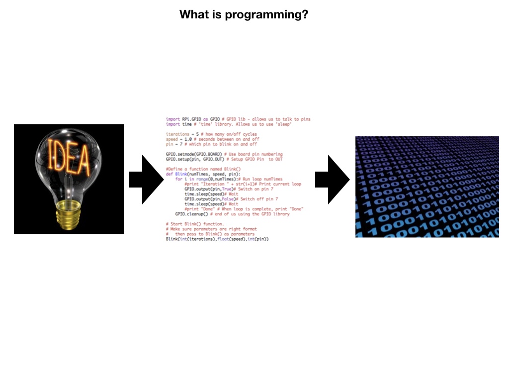

<!-- .slide: class="titleslide" -->

# Intro to Programming & Data Viz

## Jill P. Naiman
## Summer 2020
## Lecture 2

---
<!-- .slide: class="vertical_center" -->
## Basics (a reminder)

12-3PM M/T/W/Th/F

Jill Naiman - `jnaiman@illinois.edu` or `jill.naiman@cfa.harvard.edu`

 * Office Hours: TBD

TA: TBD

Class webpage: https://jnaiman.github.io/csci-p-14110_su2020/ (more on this a little later)

notes: we'll go over the class webpage a little more in a few slides

---

# Housekeeping (a reminder)

1. Don't skip class
1. Don't be late
1. No +1's in class
1. Appropriate Zoom backgrounds only

---

## Last time

* variables, variable types
* basic operations
* libraries

notes: 
last time we covered a bit about some intro stuff with Python

---

## This time

* flow control
  * for-loops
  * if-then
  * while loops (maybe)
  
notes:
this time we'll talk about a few things that are lumped into the vein of "flow control" or, in a sense - the programming part of programming!

---

# To Python for a review!

notes: 

let's review a few things in python

---

---

## A bit more about Flow Control...

notes: we've covered some basics, now lets start thinking about some more fancy things we can do with programming...

Again, this might be new to some folks and there is nothing wrong with that!  While this may seem weird at the begnning it will get easier to understand as we practice more!

We're going to tackle some stuff we'll put under the umbrella of "flow control" - i.e. how to make our code more efficient and easier to read/write

---

---

---

---

---

---

---

---

---

---

---

---

---

---

## Logical Statements - Conditional Statements 

Let's say I want to mix up what I have for breakfast.

---

## Logical Statements - Conditional Statements 

Let's say I want to mix up what I have for breakfast.

<small>I could say: "On Monday, Tuesday, Wednesday, Thursday, and Friday I eat oatmeal.  Then on Saturday and Sunday, I have pancakes."</small>

---

## Logical Statements - Conditional Statements 

Let's say I want to mix up what I have for breakfast.

<small>I could say: "On Monday, Tuesday, Wednesday, Thursday, and Friday I eat oatmeal.  Then on Saturday and Sunday, I have pancakes."</small>

| <large>Monday</large> | <large>Tuesday</large> | <large>Wednesday</large> | <large>Thursday</large> |  <large>Friday</large>  | <large>Saturday</large> | <large>Sunday</large> |
|--------|---------|-----------|----------|--------|----------|--------|
|  |  |  |  |  |  |  |

---

## Logical Statements - Conditional Statements 

Let's say I want to mix up what I have for breakfast.

<small>I could say: "On Monday, Tuesday, Wednesday, Thursday, and Friday I eat oatmeal.  Then on Saturday and Sunday, I have pancakes."</small>

| <large>Monday</large> | <large>Tuesday</large> | <large>Wednesday</large> | <large>Thursday</large> |  <large>Friday</large>  | <large>Saturday</large> | <large>Sunday</large> |
|--------|---------|-----------|----------|--------|----------|--------|
|  |  |  |  |  |  |  |

<small>OR, I could say: "On weekdays I eat oatmeal and on weekends I eat pancakes."</small>

 <table style="width:80%">
  <tr>
    <th>Weekday</th>
    <th>Weekend</th>
  </tr>
  <tr>
    <td> </td>
    <td></td>
  </tr>

 </table>

---

## Logical Statements - Conditional Statements 

Let's say I want to mix up what I have for breakfast.

<small>I could say: "On Monday, Tuesday, Wednesday, Thursday, and Friday I eat oatmeal.  Then on Saturday and Sunday, I have pancakes."</small>

| <large>Monday</large> | <large>Tuesday</large> | <large>Wednesday</large> | <large>Thursday</large> |  <large>Friday</large>  | <large>Saturday</large> | <large>Sunday</large> |
|--------|---------|-----------|----------|--------|----------|--------|
|  |  |  |  |  |  |  |

<small>OR, I could say: "On weekdays I eat oatmeal and on weekends I eat pancakes."</small>

 <table color="red" style="width:80%">
  <tr>
    <th>Weekday</th>
    <th>Weekend</th>
  </tr>
  <tr>
    <td> </td>
    <td></td>
  </tr>

 </table>

Looking for the "type" of day and making a breakfast decision is like an `if-statement`!

---

# To Python for more on this!

notes: 

let's go back to python to get into a bit of this!

