<!-- .slide: class="titleslide" -->

# Intro to Programming & Data Viz
<div style="height: 6.0em;"></div>
## Jill P. Naiman
## Summer 2020
## Lecture 3

---

## Last time

* flow control
  * for-loops
  * if-then
  * while loops (maybe)
  
notes:
last time we'll talk about a few things that are lumped into the vein of "flow control" or, in a sense - the programming part of programming!

---

## This time

* functions
* data storage & operations 
* reading in data in general
* reading in data with Pandas
  
notes:
this time we'll cover functions and reading in data using a few different methods

---

# To Python for a review!

notes: 

let's review a few things in python

---

---

## Let's talk about functions

notes: we've covered some basics, now lets start thinking about some more fancy things we can do with programming...

Again, this might be new to some folks and there is nothing wrong with that!  While this may seem weird at the begnning it will get easier to understand as we practice more!

We're going to tackle some stuff we'll put under the umbrella of "flow control" - i.e. how to make our code more efficient and easier to read/write

---


---


---


---


---


---


---


---

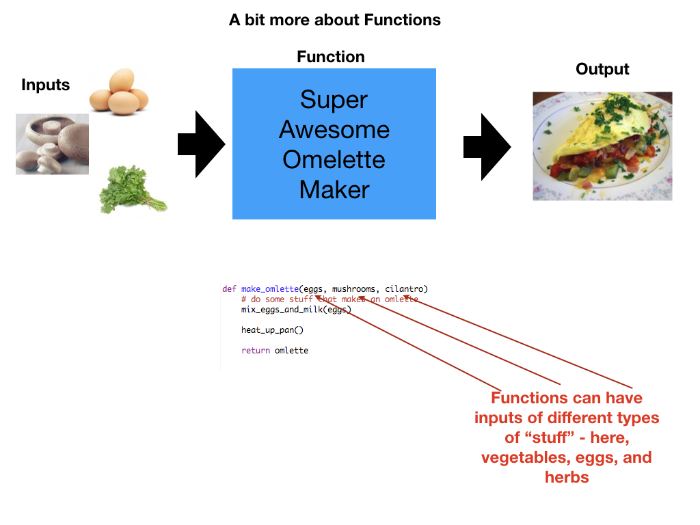

---


---


---


---


---


---

---

<br />
<br />
<br />

# More on data storage, reading and operations

---


notes:
So, often you'll see data broken into these sorts of categories - numerical or quantitative which is then broken down into discrete & continous.

Also categorical or qualitative data which is either ordered (ordinal) or unordered (nominal).

---


We need to dig a little deeper for data viz.

notes:
This is a fine for something like stats, but we have to start thinking about how data type and format maps itself visually -- what is the best mapping for our visual cortex?

---

## Data organization is important


notes:
We have to think a little bit about how our data represents reality *and* how it is represented on disk.

for example, both spatial data like that on a map and data that we use to compare salaries for example, are numerical data - we have lat/long and data value combinations for geographic data and numbers for salaries, but there is something fundementally different about how we would represent these two datasets on a visualization

Similarly for categorical data like with an organization, network, or a tree -- this data is much different than a table of categorical occurances.

---

## Example: Temporal data is numerical, but its also something "else"

<!-- .slide: class="two-floating-elements" -->

<div class="left">


</div>

<div class="right">


</div>

notes:
temporal data, like here the temperature change in a vew places over time, is numerical, but, depending on what time spans we are interested in, its can also be periodic

The first graph tell us a lot, and the 2nd may at first be a little weird to read but it tells us information about both changes in time and the averages about the place *and* it captures a central nature about this data - that it is periodic

---

<!-- .slide: class="two-floating-elements" -->

## Files, Data, and Organization

* Text
  * ASCII (raw)
  * CSV / TSV
  * JSON
* Binary
  * HDF5
  * PNG/BMP/GIF/JPG/etc
  * Excel
  * Arrow
* Query-based
  * SQL
  * JSON/REST

<div class="right" markdown=1>


</div>

notes:
We also need to worry a bit about how this data is stored on disk because that will tell us what steps are between us and (1) making the data user-friendly *and* putting into a format that we can make a visualization with

read-write operations from disk are extremely time consuming, so raw text files come with massive overhead

REST = REpresentational State Transfer - web architecture that keeps clients and servers independent and queries using flexible JSON formatting.

---

<!-- .slide: class="two-floating-elements" -->

## Files, Data, and Organization

* Text
  * ASCII (raw)
  * <span style="color:red">CSV / TSV </span>
  * JSON
* Binary
  * HDF5
  * <span style="color:red">PNG/BMP/GIF/JPG/etc</span>
  * Excel
  * Arrow
* Query-based
  * SQL
  * JSON/REST

<div class="right" markdown=1>


</div>

notes:
In this course, we'll be focusing on these 2 types and comparing our interactions with them

we *might* touch on HDF5 data at the end, but probably not

---

## The "simple" pipeline

<!-- .slide: data-background-image="images/viz_diagram.svg.png" data-background-size="contain"-->

notes: what we want is something like this where we have some data, we load it into Python/javascript/whatever and then we make a super cool viz.

---

## The "simple" pipeline... is not so simple

From: https://zenodo.org/record/3563145#.XjdvdRNKgtc

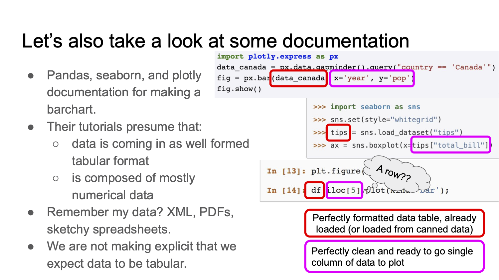

notes:
In reality, we know that this is not easy though! Especially for "complicated" data like we might run into out in the wild. While most of the data we'll use here will be less messy than "out in the wild" data, we nevertheless need to figure out how to process it a bit.

We'll get a lot of practice with this!

---

<!-- .slide: data-background-image="images/viz_diagram2.svg.png" data-background-size="contain"-->

notes:
Today we are going to practice a bit of the data-reading part ourselves, but usually we are going to be
able to make use of readers.

And we'll see how to go from raw "read in" data to data that is viz-ready.

---

<br>
<br>
<br>

# Let's consider tabular data

notes:
we will most often be using tabular datasets in this course, so its worth thinking a bit about how they are organized and how data is stored on a computer in general

I've included some slides at the end that go into more detail on how binary works on computers if you are interested, but its not required!

---

## Organization

| | Column 1 | Column 2 | Column 3 | Column 4 |
|-|-|-|-|-|
|Row 1|11|21|31|41|
|Row 2|12|22|32|42|
|Row 3|13|23|33|43|

Internally, this data is stored linearly, with one value immediately following
another.  We can do this in two methods:

||||||||||||||
|:-|-|-|-|-|-|-|-|-|-|-|-|-|
| Row | 11 | 21 | 31 | 41 | 12 | 22 | 32 | 42 | 13 | 23 | 33 | 43 |
| Column | 11 | 12 | 13 | 21 | 22 | 23 | 31 | 32 | 33 | 41 | 42 | 43 |

<!-- .element: class="fragment" -->

---

### Organization: Row

| | | | | | | | | | | |
|-|-|-|-|-|-|-|-|-|-|-|
| 11 <!--.element: class="table-hl" -->| <!--.element: class="table-hl" -->21 | 31 | 41 | 12 | 22 | 32 | 42 | 13 | 23 | 33 | 43 |

In row-oriented storage, successive _fields_ for a single _record_ are
adjacent.

<div style="height: 2.0em;"></div>

### Organization: Column

| | | | | | | | | | | |
|-|-|-|-|-|-|-|-|-|-|-|
| 11 <!--.element: class="table-hl" -->| 12 | 13 | <!-- .element: class="table-hl" --> 21 | 22 | 23 | 31 | 32 | 33 | 41 | 42 | 43 |

In column-oriented storage, successive _records_ for a single _field_ are
adjacent.

notes:
These formats are more efficient when the information you're interested in is adjacent. For instance, operations requiring many rows and only a few columns benefit from row-oriented storage.

---

## CSV (Comma-separated values)

| Column 1 | Column 2 | Column 3 | Column 4 | Column 5 |
|-|-|-|-|-|
| . | . | . | . | . |
| . | . | . | . | . |
| . | . | . | . | . |
| . | . | . | . | . |

<div style="height: 2.0em;"></div>

---

## CSV (Comma-separated values)

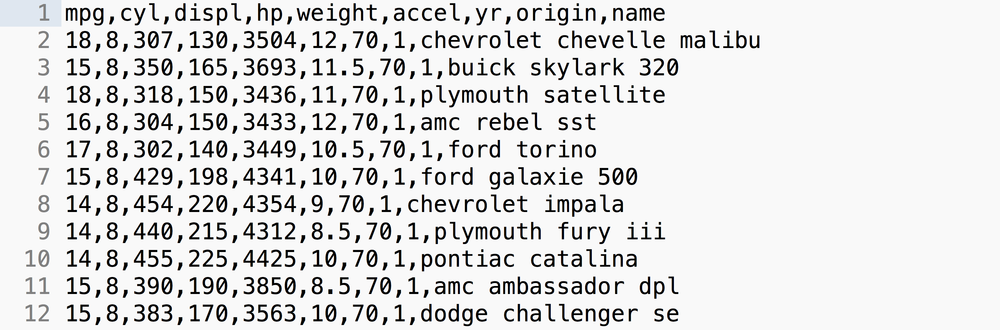

 * "Lowest-common denominator format" (widest available)
 * Flexible delimiters 
 * Ad hoc comments and headers (data readers need to be adapted)
 * Row-oriented
 * Row-size can vary: no implicit indexing

notes:
Sometimes called "DSV" or "Delimiter-separated values"

Ad hoc means data readers need to be adapted to format.

---

## Reading CSV

```
...
390,1.83970e-003,-4.53930e-004,1.21520e-002
395,4.61530e-003,-1.04640e-003,3.11100e-002
400,9.62640e-003,-2.16890e-003,6.23710e-002
405,1.89790e-002,-4.43040e-003,1.31610e-001
410,3.08030e-002,-7.20480e-003,2.27500e-001
415,4.24590e-002,-1.25790e-002,3.58970e-001
420,5.16620e-002,-1.66510e-002,5.23960e-001
425,5.28370e-002,-2.12400e-002,6.85860e-001
...
```

notes:
Let's take this sample data and see how it's represented in computer memory.

---

```

390,1.83970e-003,-4.53930e-004,1.21520e-002
```

If we assume ASCII encoding, this becomes:

| | | |
|-|-|-|
|"390" <!-- .element: class="table-hl" --> |51 |57 |48 |
<!-- .element: style="margin-left: 0.2em;" -->

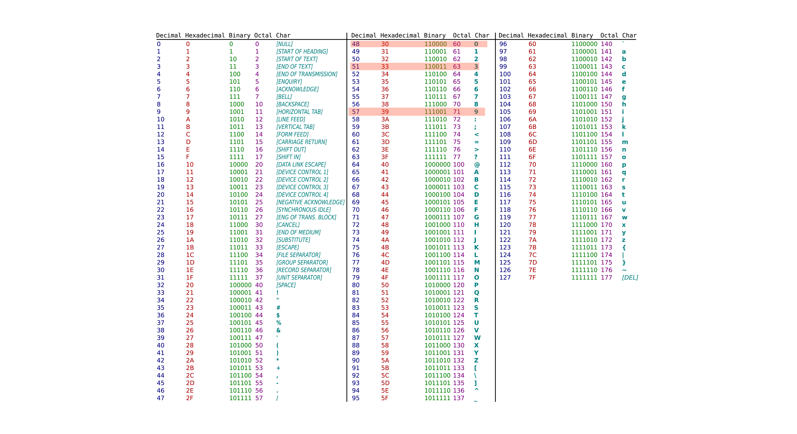

notes:
A string is not a number, but a list of characters. A character is a symbol represented by a unique byte as described in the ASCII table.

---

```

390,1.83970e-003,-4.53930e-004,1.21520e-002
```

If we assume ASCII encoding, this becomes:

| | | |
|-|-|-|
|"390" <!-- .element: class="table-hl" --> |51 |57 |48 |
<!-- .element: style="margin-left: 0.2em;" -->

Breaking this further down, we encode each character:

||||||||||
|-|-|-|-|-|-|-|-|-|
|51 <!-- .element: class="table-hl" --> | 0 | 0 | 1 | 1 | 0 | 0 | 1 | 1 |
|57 <!-- .element: class="table-hl" --> | 0 | 0 | 1 | 1 | 1 | 0 | 0 | 1 |
|48 <!-- .element: class="table-hl" --> | 0 | 0 | 1 | 1 | 0 | 0 | 0 | 0 |
<!-- .element: style="margin-left: 0.2em;" -->

notes:
if you want to ignore all about this binary stuff please go ahead!  

there are also some extra slides on how binary representations of numbers work at the end of this lecture if you are interested

---

# To Python to do stuff with data!

---

---

<br>
<br>
<br>

# An aside on binary representations.

---

## Binary

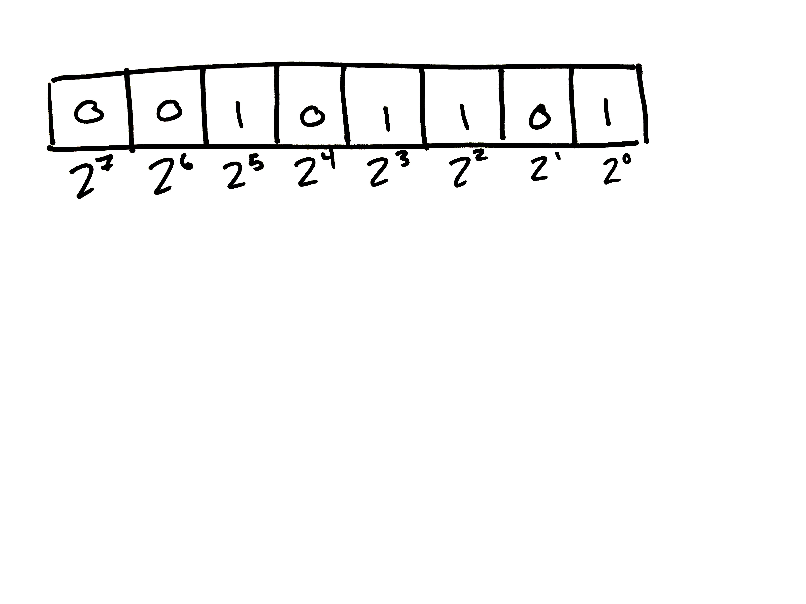

notes:
Who can tell me what decimal number these binary digits represent?

---

## Binary

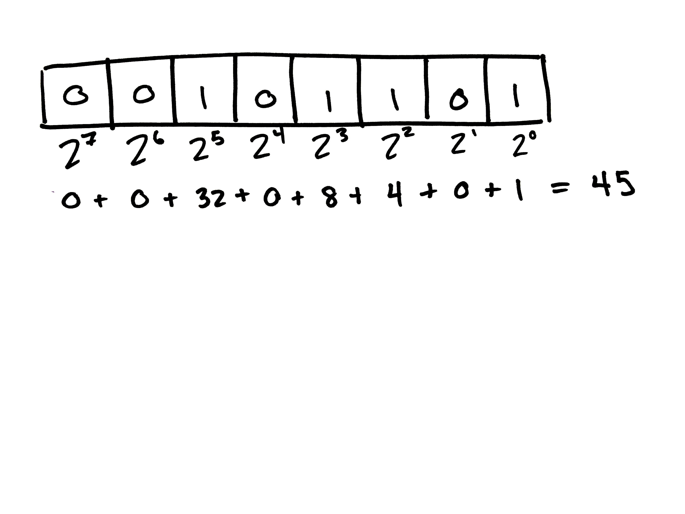

notes:
2 to each exponent is flipped on or off, then the on-values are added together.

---

## Binary

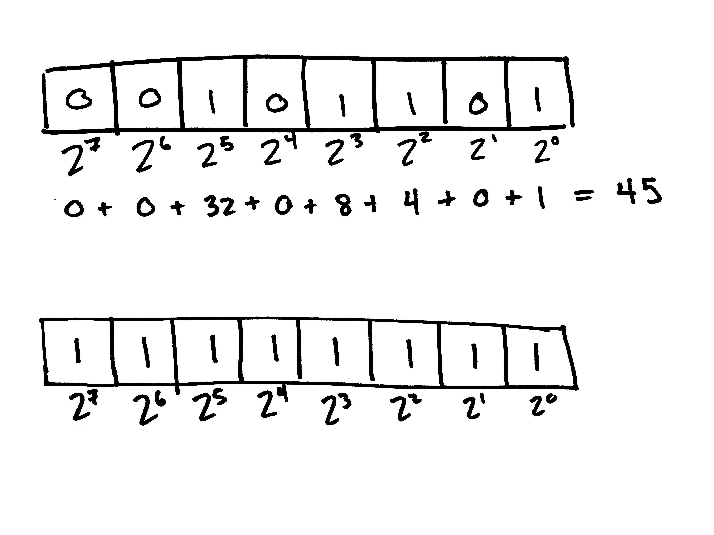

notes:
Who can tell me what these digits represent in decimal?

---

## Binary

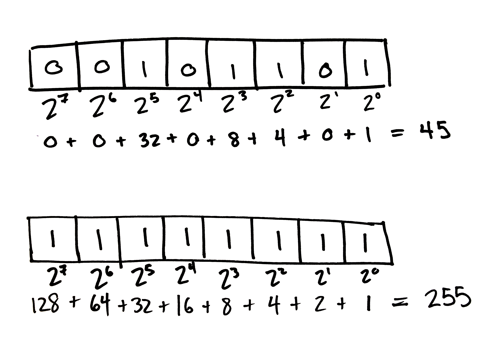

notes:
Computers use electrical current to turn millions of switches called "bits" on or off. They combine 8 bits together like this to make a "byte". 

---

```

390,1.83970e-003,-4.53930e-004,1.21520e-002
```

If we assume ASCII encoding, this becomes:

| | | |
|-|-|-|
|"390" <!-- .element: class="table-hl" --> |51 |57 |48 |
<!-- .element: style="margin-left: 0.2em;" -->


notes:
A string is not a number, but a list of characters. A character is a symbol represented by a unique byte as described in the ASCII table.

---

```

390,1.83970e-003,-4.53930e-004,1.21520e-002
```

If we assume ASCII encoding, this becomes:

| | | |
|-|-|-|
|"390" <!-- .element: class="table-hl" --> |51 |57 |48 |
<!-- .element: style="margin-left: 0.2em;" -->

Breaking this further down, we encode each character:

||||||||||
|-|-|-|-|-|-|-|-|-|
|51 <!-- .element: class="table-hl" --> | 0 | 0 | 1 | 1 | 0 | 0 | 1 | 1 |
|57 <!-- .element: class="table-hl" --> | 0 | 0 | 1 | 1 | 1 | 0 | 0 | 1 |
|48 <!-- .element: class="table-hl" --> | 0 | 0 | 1 | 1 | 0 | 0 | 0 | 0 |
<!-- .element: style="margin-left: 0.2em;" -->

---

```

390,1.83970e-003,-4.53930e-004,1.21520e-002
```

Then a string-to-float function translates the string "390" into a floating point number.

For a 32-bit, single-precision floating point number in the computer this looks like:


notes:
This is how our example would be stored as an IEEE754 Single precision 32-bit float. This IEEE standard for encoding floats tries to optimize for very small and very large numbers, with the understanding that computers cannot store infinite accuracy.

---


---

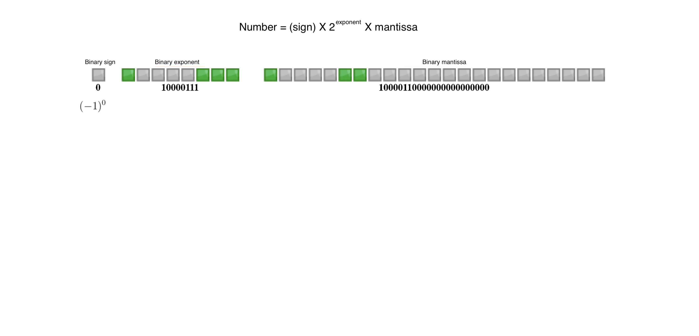

---

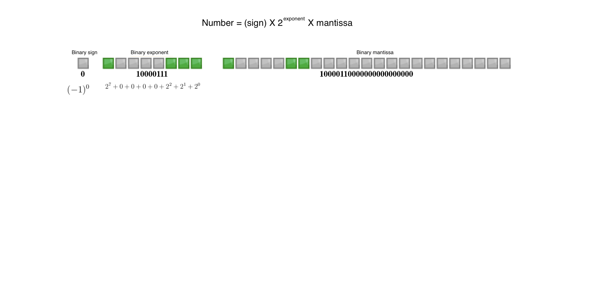

---


---

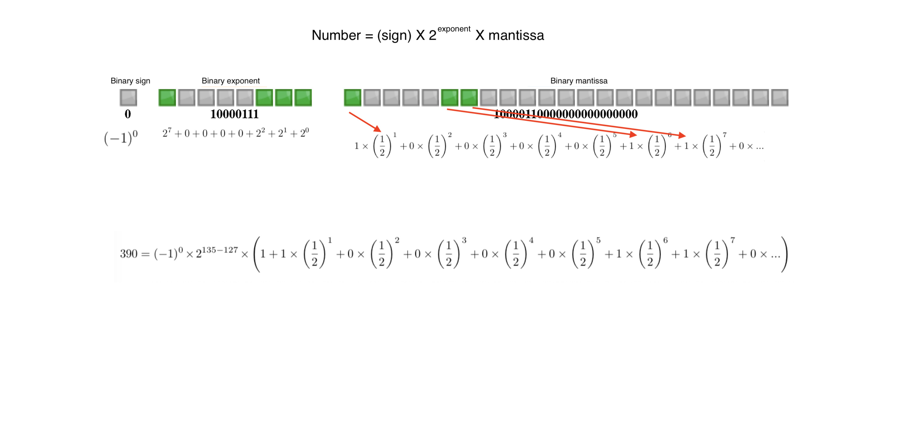

---

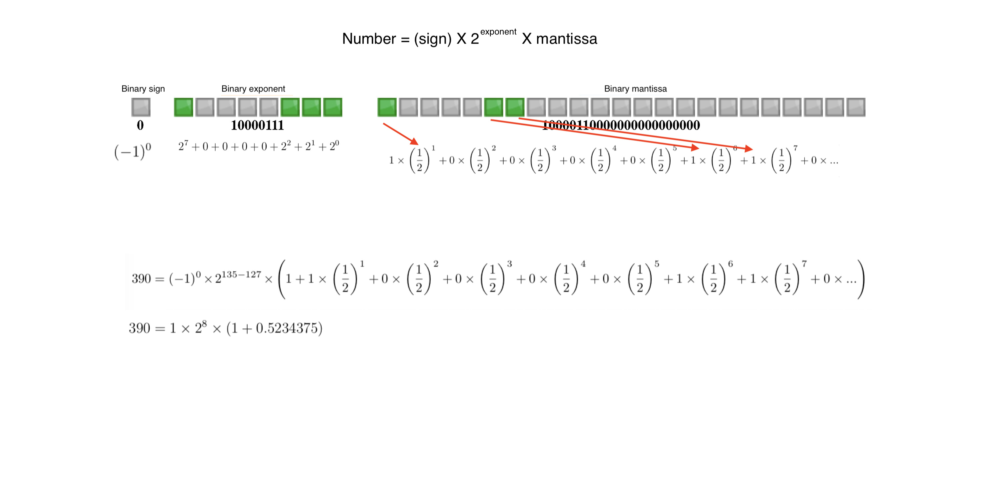

---
```

390,1.83970e-003,-4.53930e-004,1.21520e-002
```

|||||||||||||
|-|-|-|-|-|-|-|-|-|-|-|-|
| "1.83970e-03" <!-- .element: class="table-hl" -->| 49 | 46 | 56 | 51 | 57 | 55 | 48 | 101 | 45 | 48 | 51 |
<!-- .element: style="margin-left: 0.2em;"-->

And this is translated into a floating pointer number as well:

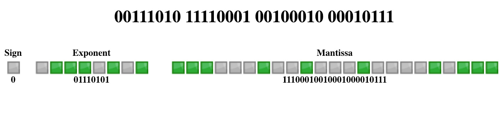

notes:
Point being, reading a CSV file is pretty processor intensive - so it's not a great format for huge datasets.
