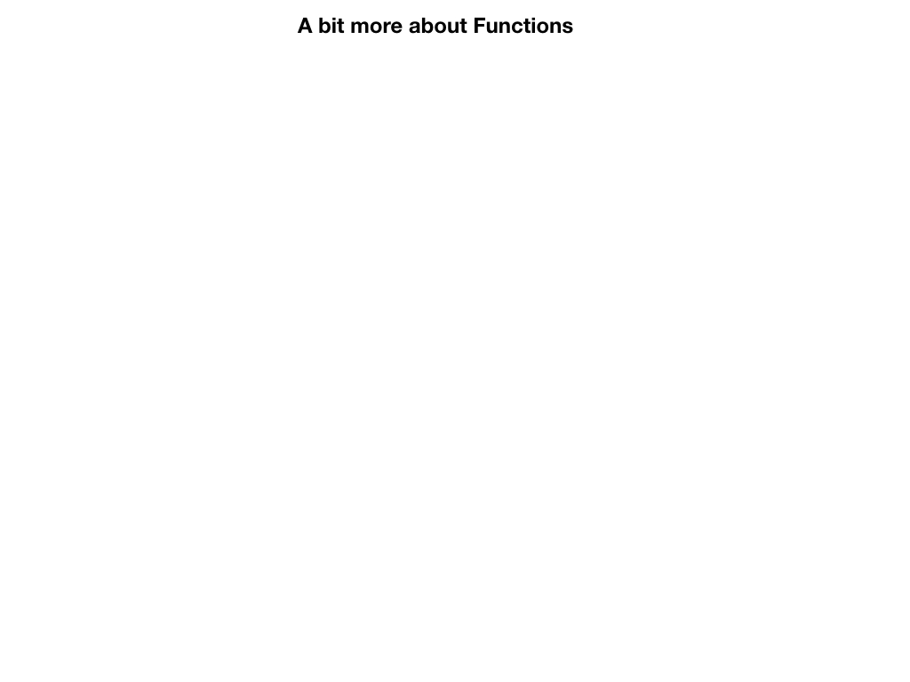
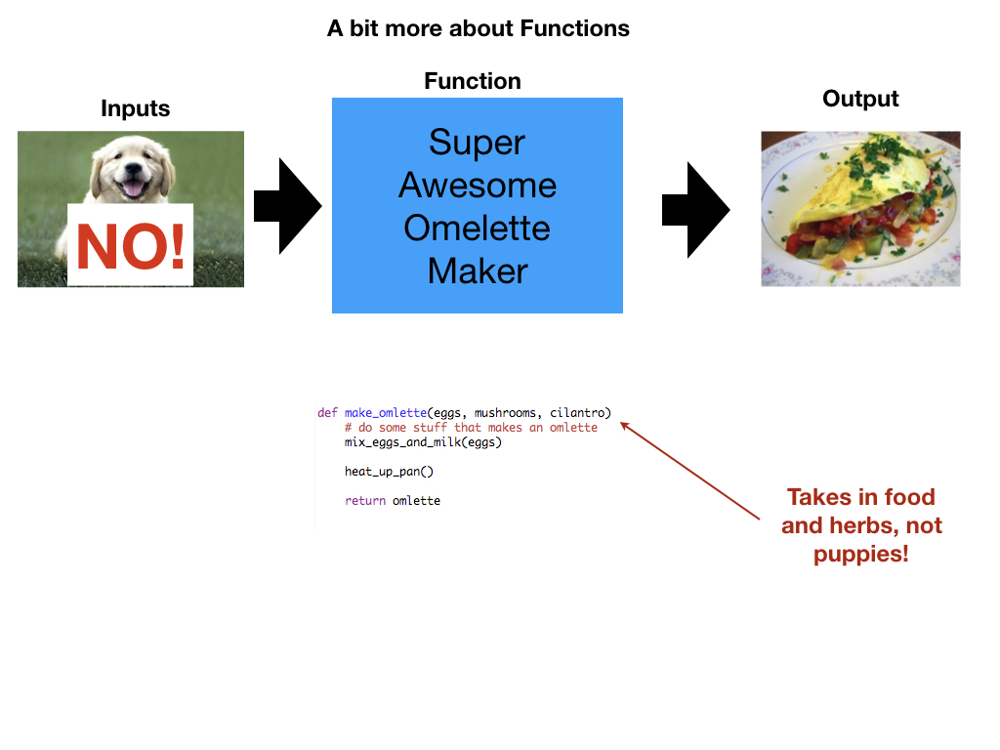

<!-- .slide: class="titleslide" -->

# Intro to Programming & Data Viz

## Jill P. Naiman
## Summer 2020
## Lecture 3

---

## Last time

* flow control
  * for-loops
  * if-then
  * while loops (maybe)
  
notes:
last time we'll talk about a few things that are lumped into the vein of "flow control" or, in a sense - the programming part of programming!

---

## This time

* functions
* data storage & operations 
* reading in data in general
* reading in data with Pandas
  
notes:
this time we'll cover functions and reading in data using a few different methods

---

# To Python for a review!

notes: 

let's review a few things in python

---

---

## Let's talk about functions

notes: we've covered some basics, now lets start thinking about some more fancy things we can do with programming...

Again, this might be new to some folks and there is nothing wrong with that!  While this may seem weird at the begnning it will get easier to understand as we practice more!

We're going to tackle some stuff we'll put under the umbrella of "flow control" - i.e. how to make our code more efficient and easier to read/write

---

---

---

---

---

---

---

---

---

---

---

---

---

---

---

## More on data storage, reading and operations
