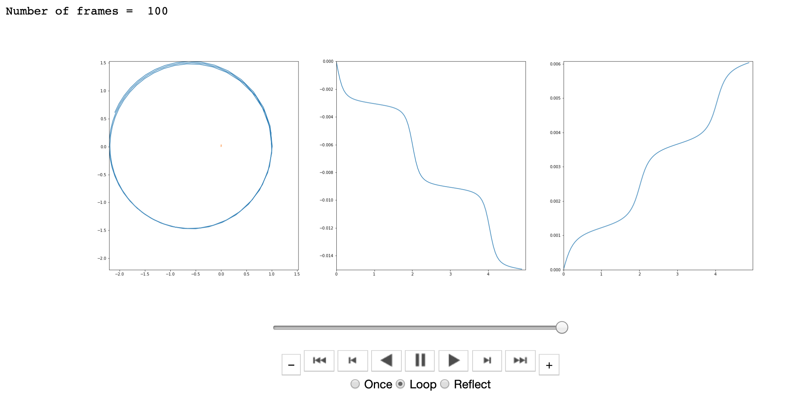

## Numerical Solutions: Can we do better?

<!---->

notes: as we saw, our simulations are not numerically stable - i.e. they do not conserve mass and momentum

this is a feature of *all* numerical models

but we can play some numerical tricks to make our solutions more accurate

---

## Numerical Solutions: Can we do better?

Increase accuracy with:
 1. smaller time steps
 1. a *higher order* solver
 
notes: we saw that we could increase the accuracy of our solutions by increasing the number of steps per period or 
decreasing the time step length

we can also choose a different solver than the Euler's for higher accuracy!

---

## Numerical Solutions: Can we do better?

Let's re-look at the Euler's Method for gravitation:

$ \vec{r}\_{i+1} = \vec{r}(t + \Delta t) = \vec{r}(t) + \vec{v}(t) \Delta t$

$ \vec{v}\_{i+1} = \vec{v}(t + \Delta t) = \vec{v}(t) + a\_g(\vec{r},t) \Delta t$

---

## Numerical Solutions: Can we do better?

Let's re-look at the Euler's Method for gravitation:

$ \vec{r}\_{i+1} = \vec{r}(t + \Delta t) = \vec{r}(t) + \vec{v}(t) \Delta t + \mathcal{O}(\Delta t^2)$

$ \vec{v}\_{i+1} = \vec{v}(t + \Delta t) = \vec{v}(t) + a\_g(\vec{r},t) \Delta t + \mathcal{O}(\Delta t^2)$

notes: in reality, we have errors on the order of $\Delta t^2$ 

where does this come from?

---

## Numerical Solutions: Can we do better?

Let's re-look at the Euler's Method for gravitation:

$ \vec{r}\_{i+1} = \vec{r}(t + \Delta t) = \vec{r}(t) + \vec{v}(t) \Delta t + \mathcal{O}(\Delta t^2)$

$ \vec{v}\_{i+1} = \vec{v}(t + \Delta t) = \vec{v}(t) + a\_g(\vec{r},t) \Delta t + \mathcal{O}(\Delta t^2)$

**Calculus aside:**

Taylor expansion: $f(x + h) = f(x) + f'(x)h + f''(x) \frac{h^2}{2!} + f'''(x) \frac{h^3}{3!} + ...$

For a time series:

$ \vec{r}(t + \Delta t) = \vec{r}(t) + \vec{r}'(t) \Delta t + \vec{r}''(t) \frac{\Delta t^2}{2!} + \vec{r}'''(t)\frac{\Delta t^3}{3!} + ...$

$ \vec{r}(t + \Delta t) = \vec{r}(t) + \vec{v}(t) \Delta t + \vec{a}(t) \frac{\Delta t^2}{2!} + \vec{a}'(t)\frac{\Delta t^3}{3!} + ...$

notes: if you haven't had calculus yet, don't worry about this part, but basically, any function, in this case position as a function of time can be broken down as a series of derivatives multiplied by $\Delta t$ - you see we take derivatives up to the derivative of the acceleration here in this case

we increase the accuracy of our simulations by taking *higher order terms*

There are many ways of doing this with a variety of solvers.  We'll first try with the *Hermite Solver*

---

## Numerical Solutions: Can we do better?

Let's re-look at the Euler's Method for gravitation:

$ \vec{r}\_{i+1} = \vec{r}(t + \Delta t) = \vec{r}(t) + \vec{v}(t) \Delta t + \mathcal{O}(\Delta t^2)$

$ \vec{v}\_{i+1} = \vec{v}(t + \Delta t) = \vec{v}(t) + a\_g(\vec{r},t) \Delta t + \mathcal{O}(\Delta t^2)$

### Hermite Solver:

**The math:**

main step: 

$ \vec{r}\_{i+1} = \vec{r}\_i + \frac{1}{2}(\vec{v}\_{i+1} + \vec{v}\_i)\Delta t + \frac{1}{12}(\vec{a}\_{i} - \vec{a}\_{i+1}) \Delta t^2 + \mathcal{O}(\Delta t^5) $

$ \vec{v}\_{i+1} = \vec{v}\_i + \frac{1}{2}(\vec{a}\_{i+1} + \vec{a}\_i)\Delta t + \frac{1}{12}(\vec{J}\_{i} - \vec{J}\_{i+1}) \Delta t^2 + \mathcal{O}(\Delta t^5) \, \, \, $  with $J = \frac{\Delta a}{\Delta t}$

$ \vec{r}\_p = \vec{r}\_i + \vec{v}\_i \Delta t + \frac{1}{2} \vec{a}\_i \Delta t^2 + \frac{1}{6} \vec{J}\_i \Delta t^3 $

$ \vec{v}\_p = \vec{v}\_i + \vec{a}\_i \Delta t + \frac{1}{2} \vec{J}\_i \Delta t^2 $

notes: so, you can see that things have gotten a bit more complicated, but we do have orders on order of 5th order!

---

## Hermite Solver: OMG

**The math:**

main step: 

$ \vec{r}\_{i+1} = \vec{r}\_i + \frac{1}{2}(\vec{v}\_{i+1} + \vec{v}\_i)\Delta t + \frac{1}{12}(\vec{a}\_{i} - \vec{a}\_{i+1}) \Delta t^2 + \mathcal{O}(\Delta t^5) $

$ \vec{v}\_{i+1} = \vec{v}\_i + \frac{1}{2}(\vec{a}\_{i+1} + \vec{a}\_i)\Delta t + \frac{1}{12}(\vec{J}\_{i} - \vec{J}\_{i+1}) \Delta t^2 + \mathcal{O}(\Delta t^5) \, \, \, $  with $J = \frac{\Delta a}{\Delta t}$

$ \vec{r}\_p = \vec{r}\_i + \vec{v}\_i \Delta t + \frac{1}{2} \vec{a}\_i \Delta t^2 + \frac{1}{6} \vec{J}\_i \Delta t^3 $

$ \vec{v}\_p = \vec{v}\_i + \vec{a}\_i \Delta t + \frac{1}{2} \vec{J}\_i \Delta t^2 $

notes: at this point you might be a little nervous that we are going to plug this whole thing into Python again

---

## Hermite Solver: OMG

**The math:**

main step: 

$ \vec{r}\_{i+1} = \vec{r}\_i + \frac{1}{2}(\vec{v}\_{i+1} + \vec{v}\_i)\Delta t + \frac{1}{12}(\vec{a}\_{i} - \vec{a}\_{i+1}) \Delta t^2 + \mathcal{O}(\Delta t^5) $

$ \vec{v}\_{i+1} = \vec{v}\_i + \frac{1}{2}(\vec{a}\_{i+1} + \vec{a}\_i)\Delta t + \frac{1}{12}(\vec{J}\_{i} - \vec{J}\_{i+1}) \Delta t^2 + \mathcal{O}(\Delta t^5) \, \, \, $  with $J = \frac{\Delta a}{\Delta t}$

$ \vec{r}\_p = \vec{r}\_i + \vec{v}\_i \Delta t + \frac{1}{2} \vec{a}\_i \Delta t^2 + \frac{1}{6} \vec{J}\_i \Delta t^3 $

$ \vec{v}\_p = \vec{v}\_i + \vec{a}\_i \Delta t + \frac{1}{2} \vec{J}\_i \Delta t^2 $

**The Idea:** Modular programming

`matplotlib.pyplot` is the plotting library we've been using to simplify how we make images.

We will now use several numerical solver libraries to simplify how we do numerical simulations.

notes: while this might seem like we are "cheating" some how in reality - this is very common.

there is no reason to re-invent the wheel! Large numerical simulations are done by different people working on different aspects of the code, and putting the whole thing together at the end

we will use this idea for doing numerical simulations from now on

(but it *is* good that we at least started by writing our own to understand how it works!)

---

# Let's try this out in Python!

