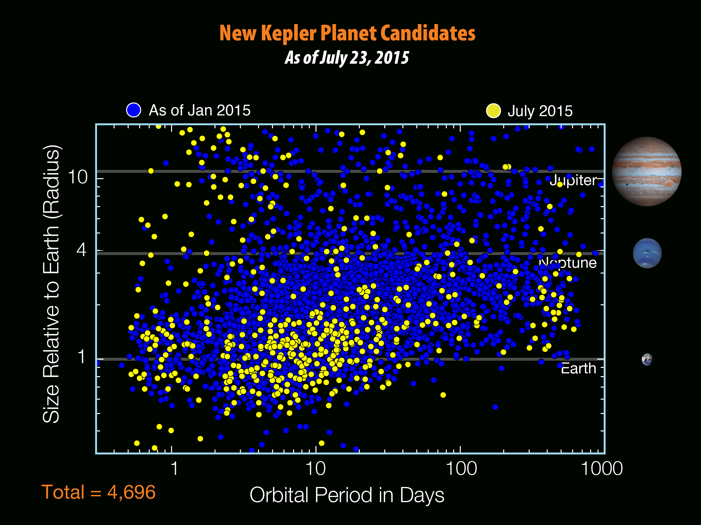

# Enough with 2-body motion: N-body!

---

## Why no 3+ body solution?

There are [some solutions, but nothing universal.](https://arxiv.org/pdf/1508.02312.pdf)

And they can get mathematically complicated:

---

## Recall:

A bit more about planets:

notes: notice that this is actually an older figure and there are actually many more planets that we've found with the Kepler telescope than is plotted here

On the y-axis here we have plotted the size in earth-radii of these planets found in a *log* scale - so at the top we are plotting objects that have sizes about the size of jupiter

On the bottom we have plotted the orbital time in days, again in a log scale.  So the earth would be right about *here*

You can see that there is a gab in the plot there and you might wonder if this is because Earths are rare.  But in fact its likely a function of how we measure these things - with Kepler we are looking for "dips" in the brightness of stars due to planets...

---

## Recall:

A bit more about planets:

<iframe width="800" height="450" src="https://www.youtube.com/embed/Td_YeAdygJE?rel=0" frameborder="0" allow="accelerometer; autoplay; encrypted-media; gyroscope; picture-in-picture" allowfullscreen></iframe>

more info: http://astro.uchicago.edu/~fabrycky/kepler/

notes: you can see this more with this nice visualization of planetary systems here - it seems like there are a lot of big, close in things, but again, this is likely because of the way we are measuring things

---

## Recall:

How can we test this hypothesis that we are "missing" Earth-like planets with our telescope?
 * Is the Solar System unusual?  Unstable?
 * How easy is it to "make" other habitable planetary systems?
 
Simulate planetary systems on the computer!
 
notes: to make educated guesses about what kinds of planetary systems might be plausable we can model them on computers 

We can see for how long, how many millions and billions of years, a particular system might live by seeing if any planets fall into the sun or are thrown out of a planetary system of a given configuration

We'll in fact do this in this class!

notice - lets talk about galaxies when we get to them

---

## Enough with 2-body motion: N-body!

But first, let's play a game:

[Super Planet Crash](http://www.stefanom.org/spc/) - http://www.stefanom.org/spc/

Bonus game (if you get done): [Orbits Game](http://save-point.herokuapp.com/dashboard/users.php)

notes: make note of what makes a stable system and what makes an unstable system

---

# Let's use our Hermite solver to make some stable orbits! (in 2D)

1. Try with 2, then 3 then... bodies
1. Is energy conserved?
1. Bonus: make an animation showing were, if at all, energy is lost

notes: try with a 2 body, 3 body... etc

try to make a stable system with each number of bodies and see what it takes

