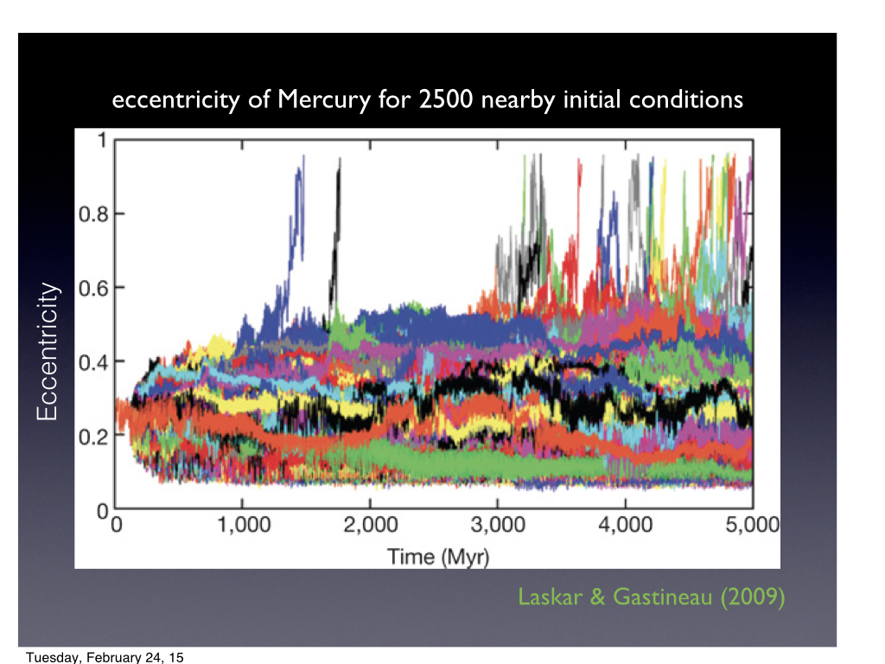
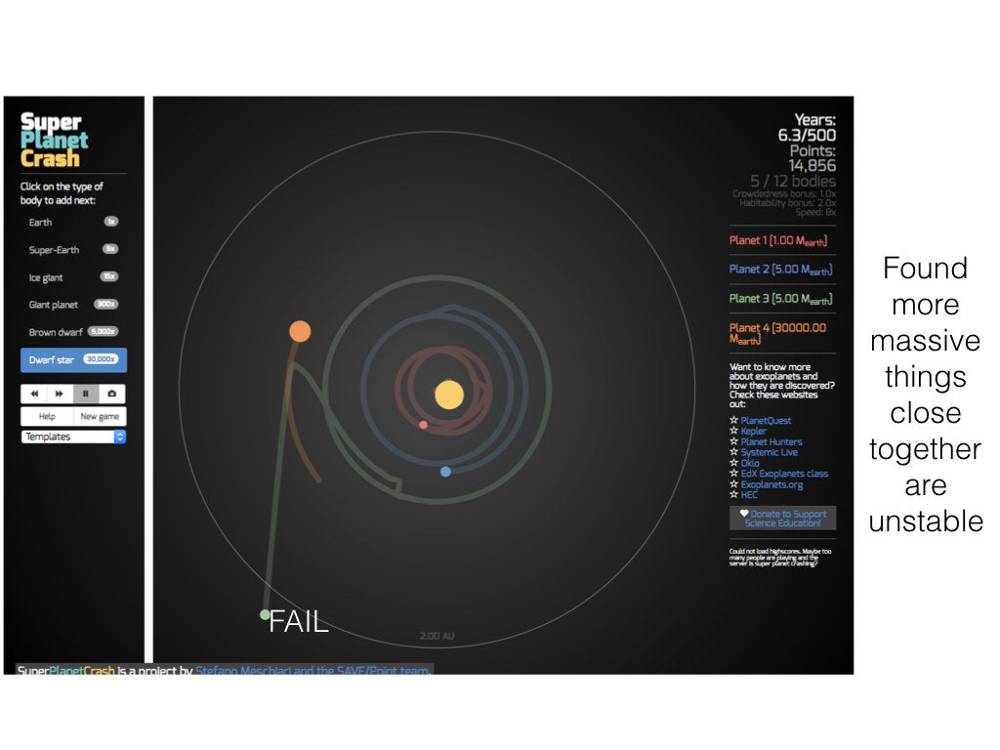
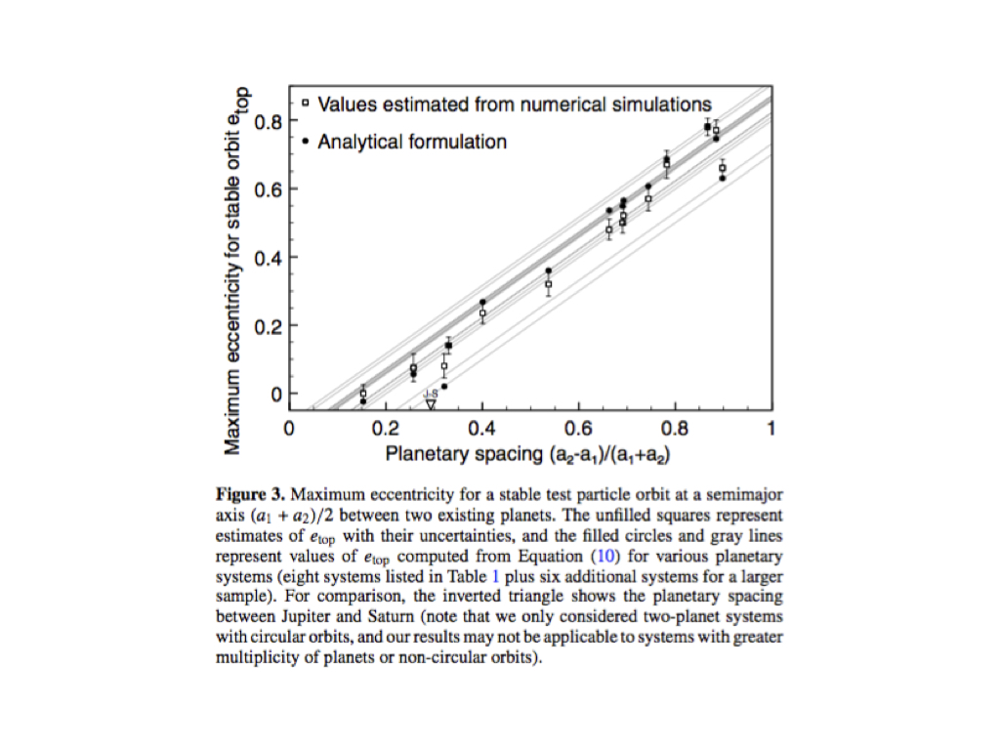
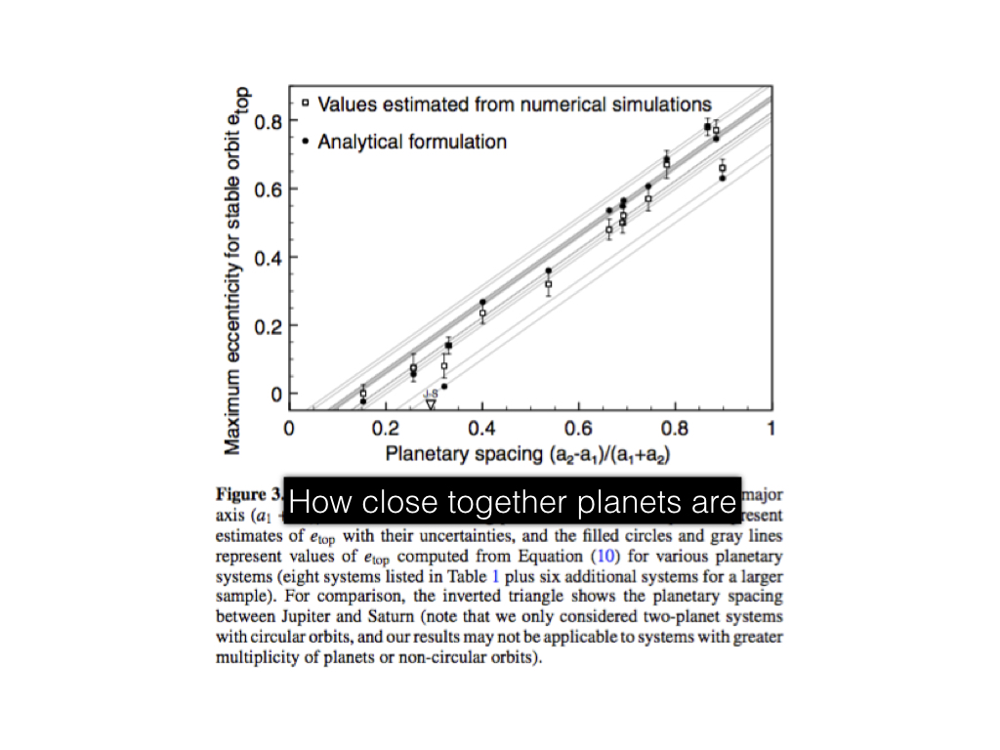

# Kepler's Data - Simulating Real Planets

---

## Simulations of our Solar System

notes: here is a figure from a paper showing several realizations of the orbit of mercury

all of these initial conditions - placement, initial eccentricity, etc - are all within what we think are likely for an early mercury

---

## Simulations of our Solar System

notes: we can see in some cases the eccentricity grows infinitely - meaning it goes from an elliptical orbit to a parabolic or hyperbolic orbit

---

## Instability of Planetary Systems

notes: from our investigations and games like super planet crash, we learned that more massive planets tend to destabalize systems

---

## Instability of Planetary Systems

notes: you also may have found that if you try to put planets close together, that can cause some instability

---

## Instability of Planetary Systems

notes: here you can read the bottom axis as the "seperation between planets" basically

this is showing how eccentric the planet is vs. how far apart you can make things - if you have very eccentric orbits, you're system is naturally less stable and so you can't cram in planets very close together.

---

## Instability of Planetary Systems - Real Systems

The Kepler Telescope:

notes: as we've mentioned before, a lot of what we know about other planetary systems comes from the Kepler's telescope

now we are going to use actual data from the Kepler telescope to simulate real live planetary systems!

---

# Kepler Systems in Python - reading and writing data!

notes: we'll also talk a bit about how to read and write data in python so you don't have to keep running simulations all the time

this is especially important for data viz next week - you'll want to have some things saved and ready to go

also, if you want to compare simulations - it's nice not to have to re-run a bunch

---

