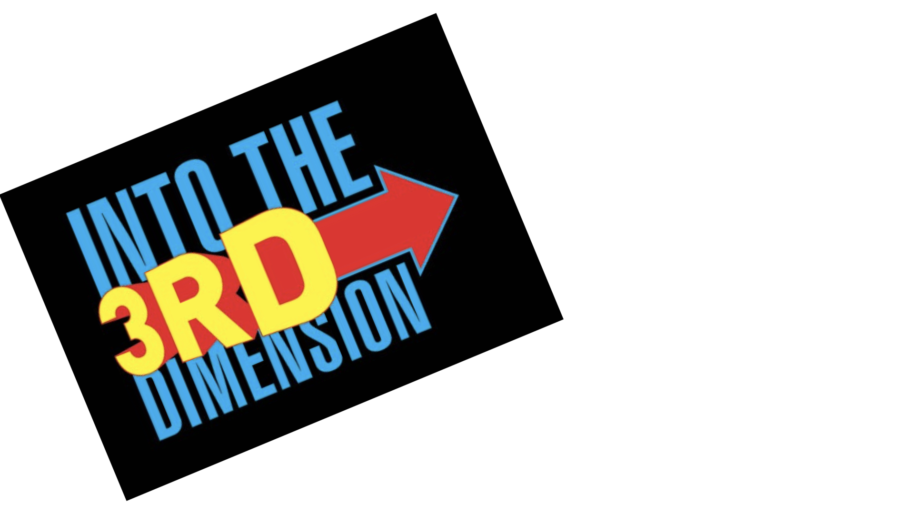
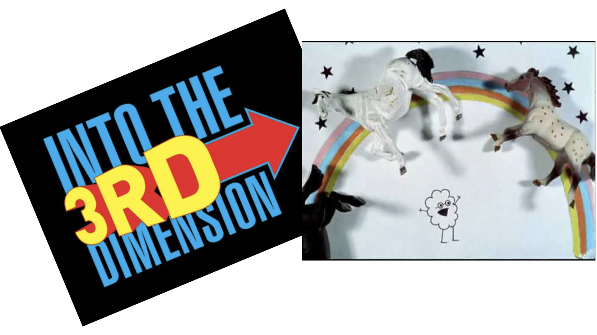
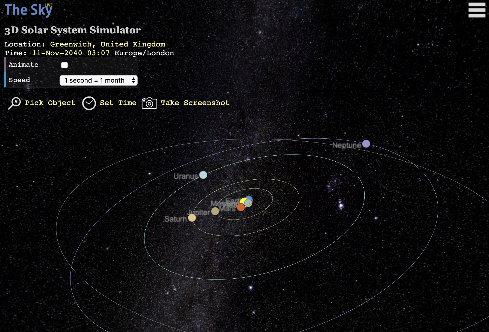

## Some hints about stability

* We know that a vector perpendicular to $(x,y)$ has components $(-y,x)$. So, first we reconstruct our velocity vectors so that have components $(-r\_y, r\_x)$ for each position vector $(r\_x, r\_y)$.
* Then we renormalize each velocity vector such that it has the same magnitude as the original velocity vectors.
* Play with each initial velocity by changing $v\_x$/$v\_y$ slightly until you have a (fairly) stable orbit.
* Then add in another body with a position and velocity that includes a z component. Make sure you don't renormalize this as well when you do the above 3 steps for the original stable-ish system!

---

# Continuing on...

notes: today we are finally moving into doing some 3D simulations

---

# Continuing on...

notes: hurray!  this is very exciting for our previously 2D selves

---

# Continuing on...

Start thinking about a system you want to visualize...

notes: now is a good time to start thinking about some systems you want to visualize

if you have a system you like - save this system to a text file for reading in later

remember: you can always save another one you like better if you get there!  its more important to have something saved than what you think might be your *final* solution

---

## Three dimensional simulations

Options:
* add 3D component to planets
* galaxy simulations

notes: so, we will have a few options now - you can stick with planetary systems, if that is your jam, and start to move your simulations into 3d

we'll talk about other solvers for systems like Rebound that will do the solar system for us, but for now you can start adding these things *by hand*

---

## Three dimensional simulations - Planets

The solar system is actually a 3D system!

[https://theskylive.com/3dsolarsystem](https://theskylive.com/3dsolarsystem)

notes: this link is also on the index page

also also - this is an example of an interactive 3D online viz... keep this in mind for next week

---

# Three dimensional simulations in Python!

notes: let's look over some starter files for attacking these 3D problems in Python 

and we'll discuss extentions you can choose to work on or not!

