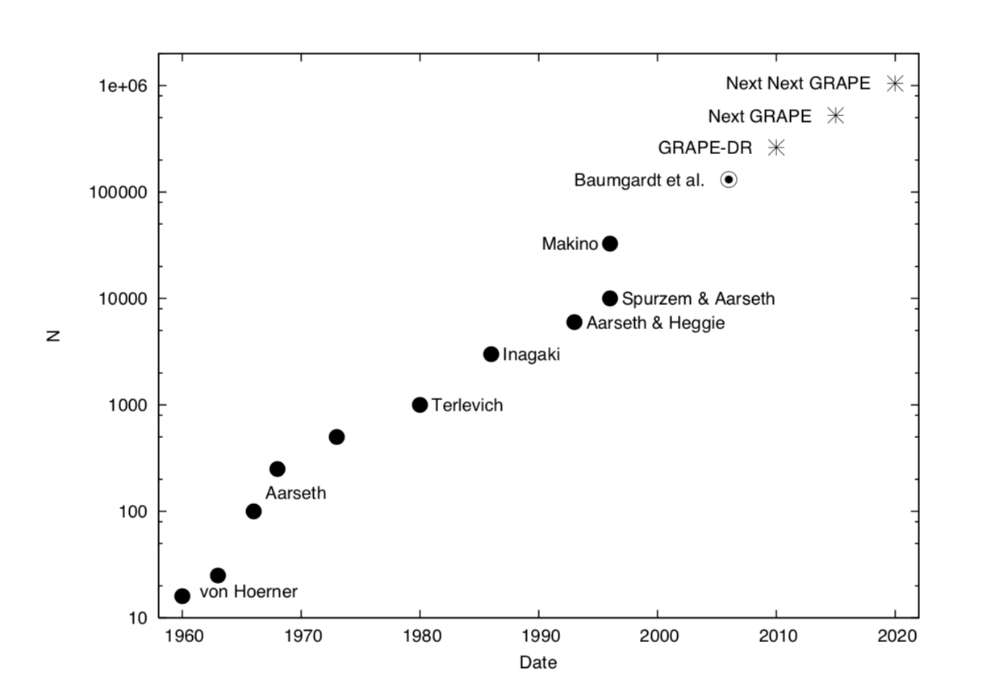
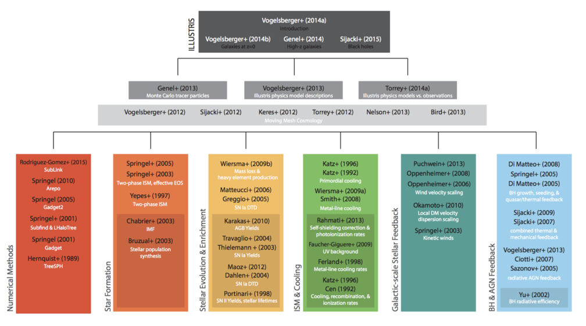
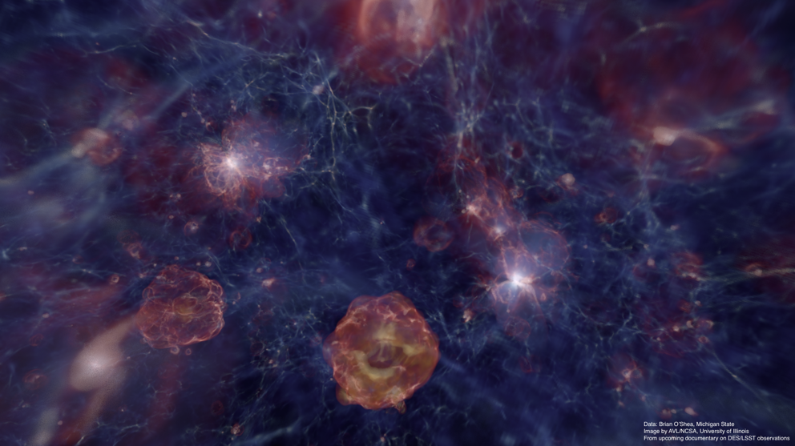
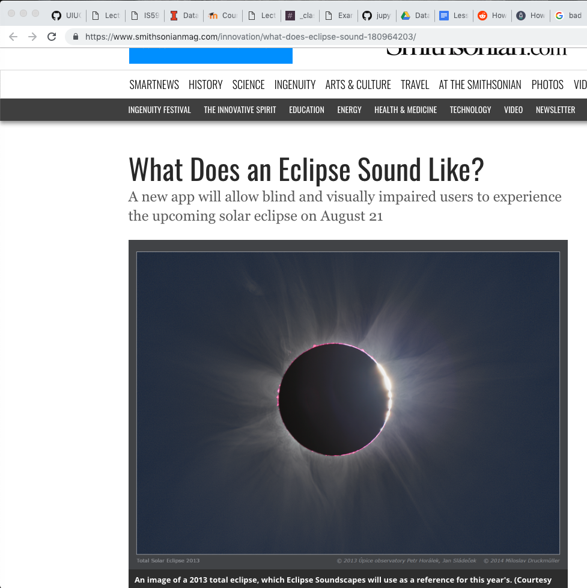

# Intro to Data Visualization

---

# Current list of accomplishments

 * Physics
   * Circular motion
   * Gravity
 * Math
   * Ellipses
 * Programming
   * Flow control
   * Plotting
   * Numerical solvers
   * Modular programming

---

## Modular programming

 * in HW: had to "figure out" what part of the code to change to play with gravitational laws other than $F\_g \propto 1/r^2$
 * Also aren't we lucky to have a $1/r^2$-law for gravity!
 
notes: we practiced modular programming on the HW where had to "find" were we had to change a function

---

## Physics aside: the extra credit part of the HW

Gravity doesn't actually pull things toward one another, but massive objects actually warp space-time around themselves.

---

## Physics aside: the extra credit part of the HW

notes: here is the animation of a two body orbit in a strong gravitational field (i.e. a massive object where a planet is orbiting close to it) in the newtonian and "post newtonian" approximation that you simulated in the extra credit

you can see that the 2nd orbit "precesses" like the orbit of mercury does, though mercury's is not as pronounced

Mercury's orbit is a great test of GR it turns out!

---

## Physics aside: the extra credit part of the HW

note: of course we have other tests of GR as well, like this first picture of a black hole

this one is a super massive BH at the center of a nearby galaxy and the ring is the disk of mater swearling around it - its asymmetric here because of the warping of space-time as well

the center is bigger than our solar system and is where gravity is so strong that even light cannot escape and so it looks black!

---

## Comments on reading for HW

 * Spans "start" and current computational physics efforts

note: I use the "start" here in quotes because in reality astrophysicists have been use programs to solve physics problems since the early 1900's, but we are only in a position now where we can actually start solving large scale problems

---

## Comments on reading for HW

 * Spans "start" and current computational physics efforts
 * Moore's "Law"
 

notes: the first article also mention's moore's law

here "law" is in quotes since its not something that is like the law of gravitation that can be proven with experiements, its just a generic relation

here its shown as the number of particles that can be simulated vs time

---

## Comments on reading for HW

 * Spans "start" and current computational physics efforts
 * Moore's "Law"

notes: while this is specifically for n-body simualations, it comes up a lot in different computational problems and comes from a fundemental limitation to how we can design computers

here we see different phases in which different materials make up computers

"Moore's Law" is the era of about 1960-present day in which we are making computer chips (ICs) out of silicon.  We are reaching the end of this era - basically we can only make silicon parts so small.  What happens after when we move into the era of human-brain sized computing?  We don't know yet!  stay tuned!

---

## Comments on reading for HW

 * Spans "start" and current computational physics efforts
 * Moore's "Law"

notes: while not everything in computing follows moore's law exactly, much of what we can do - be it computatial physics or just posting and commenting on cat videos - relates very strongly with our processing power

---

## Comments on reading for HW

 * Spans "start" and current computational physics efforts
 * Moore's "Law"
 * Computational power

notes: we now have the ability to compute large things in physics, but we still need things like super computers to do it, here is the Hazel Hen supercomputer in germany that was used to run some simulations I've been a part of

why such large computers? hazel hen has 185,088 compute nodes, so essentially, about 25,000 of my laptops (which, with hyperthreading has 8 cores and I had to order extra special). And it still took about 6 months for us to finish our simulation with a few billion particles.

---

## Comments on reading for HW

 * Spans "start" and current computational physics efforts
 * Moore's "Law"
 * Computational power

notes: so why so big?  well because we aren't just simulating gravity, we have to do alot of other things as well

we also have to manage communication between large and small scale things - like how small things like winds from stars affect large things like galaxy evolution, so we need fast communication between all of our processors as well

here is another example of a "modular" programming style - there are different sorts of elements to the simulation I worked on, I just worked on one tiny bit - the return of elements from stars back into the Universe, but there are these papers (and many others) that worked on other aspects one needs!

---

## Comments on reading for HW

 * Spans "start" and current computational physics efforts
 * Moore's "Law"
 * Computational power - problem of scales of time and space
   * ex: star/galaxy sizes is factor ~ $10^{12}$ ("terra"), we can do ~$10^{10}$ now

<!--<source src="./images/zoomtrimmed.mp4"/>-->
<source src="http://www.illustris-project.org/movies/illustris_movie_zoomin.mp4" />

notes: if this doesn't work, have page open

another problem with simulating realtiy is one of scales - if you want to get things right, you have to be able to simulate the very small as well as the very large

for example, if we want to see stars form correctly, we have to similulate them individually, but this is at a much smaller scale and with a much smaller timestep then things that happen on the large scale - this means we need about a terra-star amout were we can only do a few billion (or 10^9) at the moment, so we are a ways off

you can do things like do different time steps at different places in your simulation and have them "sync up" on occasion, but this still doesn't solve the problem of size scales

---

## Comments on reading for HW

 * Spans "start" and current computational physics efforts
 * Moore's "Law"
 * Computational power
 * What is dark enegy?

Short answer: we don't know!

---

... longer answer:

notes: basically, we don't know what it is, but we know that its there

we can go out an measure how quickly things are expanding away from us as the Universe expands from something called "the big bang" which was the beginning of the universe when everything was a tiny infinitely small dot

we can observe that this expansion is *accelerating* and therefore there must be another form of enery somewhere in the universe pushing things apart

again, we have no idea what it is (though there are some theories, one even left over from Einstein's work!) but we can see its effects

---

# Onto viz!

---

# A note on Viz Terminology

 * Visualization
 * Information Visualization
 * Scientific Visualization
 * Simulation
 * Illustration
 * Scientific Illustration

notes:
visualization goes back to cave men painting star-tracking imagery during the Pleistocene Era

illustration can be motivated by experts as well, but it can be problematic when an audience thinks it's real - which can be especially problematic when the presentation is so well done that it looks photographic.

---

# Terminology

1. Science Viz
  * Time evolving spatial data viz
  * 3D rendering
  * VR
1. Info Viz
  * bqplot
  * linked dashboards

notes: we'll cover broadly two types of viz - scientific and info viz.

The scientific viz part will cover making cool movies and online things with your simualtions

The info viz part will cover "supporting" data from sources connected to the Kepler data.

Both of these topics are *huge* in their own right and you can do entire courses on each! We'll just cover a bit of each to get an idea of what they are like and I'll refer you to some resources to explore on your own after the class if this stuff is interesting to you

---

### My background
#### ytini.com

Naiman et al. 2017, Borkiewicz et al. 2018

notes: so last week we talked about the processes of simulating physical phenomena with a computer, something that I did for a large part of my postdoc at the center for astrophysics here at Harvard

now we'll talk about another subject that is near and dear to my heart -data viz!

---

### My background
#### ytini.com

Naiman et al. 2017, Borkiewicz et al. 2018

---

### My background
#### ytini.com

Naiman et al. 2017, Borkiewicz et al. 2018

---

### My background
#### ytini.com

Naiman et al. 2017, Borkiewicz et al. 2018

---

## How this week is going to look

* Intro lecture/activity on a viz concept
* Short programming activity
* Use ideas-of-the-day to visualize your scientific data

---

## Timed activity! (~2 minutes)

On a piece of paper or in notes on your computer:

* What are the most memorable movies you saw over the last year?
* Do you prefer cats or dogs?
* How would you quantify your experience in visualization?
* How many hours do you spend on school work each week?

notes:
We're going to use these pieces of data to explore how we might approach
visualization.  Each of these items is a different *type* of data --
qualitative, quantitative, elements drawn from sets, and sets of numerical
data.

Trying to visualize each one will give us a basic idea of how we might think
about these types of data, and how we approach visualizing them.

---

## Breakout Groups: 

### Group #1:

Break into groups of 2-3 folks:

(1) Share one thing you learned last week that you're excited to apply to data visualization this week. 

(2) visualize the results from the data you wrote down previously - you can use your hands, a piece of paper, your computer or anything else you can come up with!

notes:

We'll do this for ~5 minutes, maybe longer depending on where
people are.

---

## Breakout Groups: 

### Group #2: Combine your group with another group

* Present your viz to the other group.
* The other group will try to guess what your visualization is trying to convey.
* Discuss how well the group did with their guesses & why you think that is.
* What things did they like about your visualization?  What things would they change?

There are no hard and fast "right" or "wrong" answers at this point, so don't worry!

---

## Class outline: Syllabus

### Computational Physics Week

 * Day 1: Introduction, syllabus, examples, and some basics about Astro, Physics, Programming
 * Day 2: Gravity, calculating 2-body orbits, more programming
 * Day 3: Numerical and analytical solutions of orbits for 2-body problem
 * Day 4: Multi-body problem in 2D
 * Day 5: Multi-body problem in 3D
 
### Data Visualization Week

 * Day 1: Intro to data viz, simple 2D movies, interactivity
 * Day 2: Info viz and more on interactivity in 2D
 * Day 3: Plotting in 3D in Python interactively
 * Day 4: Graphic concepts, web-viz, 3D geometries
 * Day 5: 3D movies online, finalization of projects, viz party!

notes: so this is where we are - we did the computation physics part! Now its time to make some pretty things!

---

# Class Mission

While you are already a _consumer_ of visualizations, your
perspective should change to that of a _producer_ of visualizations.
You should be comfortable reading AND writing imagery.

notes:
We will be discussing this as the course goes on, but the principal outcome I
want you to take away from this class is understanding how to transform data
into its visual representation, and to take that understanding with you as you
observe visualizations presented to you.

By developing visualizations, you will grow to understand the choices that
influence those visualizations, and you will bring that with you while
consuming information visually.

Here we will focus on scientfic visualizations, but we'll touch a bit on another type of visualization - *info viz* 

---

## Overview - Themes and Goals

1. What are the components of an effective visualization of quantitative data?
1. What tools and ecosystems are available for visualizing data?
1. What systems can be put in place to generate visualizations rapidly and with high-fidelity representation?

---

## This intro class

 * Why do we visualize?
 * What types of data do we visualize?
 * How do we visualize?

notes:
We're going to start out at a very high-level, discussing why we choose to
visualize versus other types of representation, what types of data, and how we
might do it.

---

# Why?

(Or rather, why _wouldn't_ we visualize?)

notes:
Not everything suits itself to visualization -- and part of the reason for that
is the necessary reductionism that visualization can require.

---

# We can't visualize everything

Peg + Cat:
https://www.youtube.com/embed/In72QAQJ1tY?rel=0

notes:
"There are lots of thing you can compare on a graph / Like who is the shortest
or the tallest giraffe / You can chart how much you walk / How much that you
laugh / There are lots of things you can compare on a graph"

"But the one thing you can't chart / Is how you feel in your heart"

---

# We can't visualize everything

Peg + Cat:
https://www.youtube.com/embed/In72QAQJ1tY?rel=0

"There are lots of thing you can compare on a graph / Like who is the shortest
or the tallest giraffe..."

notes:
"There are lots of thing you can compare on a graph / Like who is the shortest
or the tallest giraffe / You can chart how much you walk / How much that you
laugh / There are lots of things you can compare on a graph"

"But the one thing you can't chart / Is how you feel in your heart"

---

# We can't visualize everything

Peg + Cat:
https://www.youtube.com/embed/In72QAQJ1tY?rel=0

"But the one thing you can't chart / Is how you feel in your heart"

notes:
"There are lots of thing you can compare on a graph / Like who is the shortest
or the tallest giraffe / You can chart how much you walk / How much that you
laugh / There are lots of things you can compare on a graph"

"But the one thing you can't chart / Is how you feel in your heart"

---

# We can't visualize everything

notes: notice here that while we are going to focus of "visual" visualations in this class, there are actually many other ways to transmit information that we are not going to focus on but are equally important

for example, this is an app a collegue of mine made that allows for the blind and visually impared to experience the last US solar eclipse with touch and sound

---

# We can't visualize everything

notes: check out eclipse sound scaples *dot* com for more info on this

---

<!-- .slide: data-background-image="images/fov.svg" data-background-size="contain" -->

notes:
Visual information is communicated through our eyes, where it is processed.  At
the most basic level, we can see a range of about 210 degrees horizontally with
one or both eyes.  The region that is covered by both ("binocular") is about
114 degrees in extent.

You can only cram so much information into the human eye.

---

By Vanessa Ezekowitz [CC BY-SA 3.0](https://creativecommons.org/licenses/by-sa/3.0), via Wikimedia Commons

notes:
When we think about visual communication of information, we *must* think about
how human physiology interacts with that communication.

Also, fair warning: I'm not a medical doctor.

This diagram shows the visual acuity of a "standard" human eye, as a function
of angular distance from the fovea.  We have to think about this in
*conjunction* with our field of view.

---

# Your brain does interpolation

There are 12 dots, can you count them all at the same time?

---

# Your brain does interpolation

Step 1: Look at the cross

Step 2: Close left eye, keep looking at the cross

Step 3: Slowly move your head toward & away from screen until dot disappears

notes: you may want to actually do this on your own computer screen by importing these lecture slides

---

# Your brain does interpolation

Step 1: Look at the cross

Step 2: Close left eye, keep looking at the cross

Step 3: Slowly move your head toward & away from screen until dot disappears

# ... and sometimes it gets it wrong!

---

# Who are you visualizing for?

* For yourself?
* For a peer?
* For someone else?

notes:
*Whenever* you build a visualization you need to think about the context that
you can assume on the part of your viewer.

ask questions like - what does my viewer know? what might they already think about the topic I'm presenting them?

---

# Tenet 1:

"Visualizing data" is not a strict subset of "making an image."

notes:
We will approach visualization as encompassing several different stages in the
collection, organization and representation of data.

---

# Tenet 1:

"Visualizing data" is not a strict subset of "making an image."

It involves:
 * Collection of the data
 * Organization of that data
 * Representation of that data

notes:
We will approach visualization as encompassing several different stages in the
collection, organization and representation of data.

---

# Tenet 2:

We tell lies to visualize, but we _must_ be honest.

---

### "The Principle of Proportional Ink" - callingbull****.org

notes:
So let's first talk about how misleading visualizations can be. This 3D pie chart violates the "principle of proportional ink" which states that the number of pixels that represent a value should be proportional to the value. With the raised edge on the pie chart, the blue wedge gets way more ink than it deserves and you get a disproportionate sense of value.

---

### "Spurious Correlations" - tylervigen.com

notes: you can have a lot of absurd fun with data - but when data is presented in a visualization, people often believe the authority of it even if it's outlandish. 
also know: This guy has some good ideas of where to find sample datasets if you want to do more info viz!

---

<!-- .slide: data-background-image="images/gunDeaths.jpg" data-background-size="contain" -->

notes:
Now here's an example that's more brazen. I'll give you a minute to analyze this and tell me what's wrong with this graph.

Some people will claim the Y-axis should always start from the bottom - at zero - to avoid confusion.

---

<!-- .slide: data-background-image="images/hearts_battery.svg" data-background-size="contain" -->

---

<!-- .slide: data-background-image="images/battery.svg" data-background-size="contain" -->

 1. Sensors read the current "fill" of the battery
    * Analog / digital conversion
    * Normalized with respect to expected "full"
 1. This is then scaled to a percentage
 1. The battery image is filled from left to right
 1. The image is then rasterized and displayed

---

<!-- .slide: data-background-image="images/hearts_bw.svg" data-background-size="contain" -->

 * Some fixed maximum amount of damage
 * Each time damage is taken, decrement
 * Each time damage is reversed, increment
 * Display number of hearts as appropriate

---

2 out of 3 "points"

<!-- .slide: data-background-image="images/hearts_color.svg" data-background-size="contain" -->

---

<!-- .slide: data-background-image="images/hearts_color.svg" data-background-size="contain" -->

---

<iframe width="1024" height="576"
src="https://www.youtube.com/embed/D-uBv6jB7r0" frameborder="0"
allow="autoplay; encrypted-media" allowfullscreen></iframe>

notes:
How could this visualization be misleading? What about the camera move? What about the colors used? Are there actually several distinct layers of shells or is this a continuous volume?

---

## Honesty

Our choices must be:

 * Deliberate
 * Informed
 * Motivated
 * Justifiable

---

## Election Maps

Mark Newman of the University of Michigan has created visualizations of the
election maps from several of the most recent elections.  For more information
and context, see his page http://www-personal.umich.edu/~mejn/election/2008/ .

 * [Map 1](http://www-personal.umich.edu/~mejn/election/2008/statemapredbluer1024.png)
 * [Map 2](http://www-personal.umich.edu/~mejn/election/2008/statepopredblue1024.png)
 * [Map 3](http://www-personal.umich.edu/~mejn/election/2008/countymapredbluer1024.png)
 * [Map 4](http://www-personal.umich.edu/~mejn/election/2008/countymappurpler1024.png)
 * [Map 5](http://www-personal.umich.edu/~mejn/election/2008/countycartpurple1024.png)

notes:

MAY SKIP

These are great, but some criticisms might be that the color red is more apparent to the human eye than the color blue. And in the population-to-area adjusted maps, it's difficult to read for people used to geographic accuracy.

Map1 - this is just a geographical map of red and blue

Map2 - cartogram weighted by population (note, NOT by electoral college population)

Map3 - election results by county

Map4 - percentage of votes by county

Map5 - percentage of votes by county, weighted by population

---

## Getting started on Viz in Python

*Open up Python & get started coding!*

---

## This week: Wrap-up

 1. We visualize to change how we understand things.
 1. We visualize data for ourselves, for our peers, and for others.
 1. Visualization is a series of steps that we take to produce a different
    representation of data.

