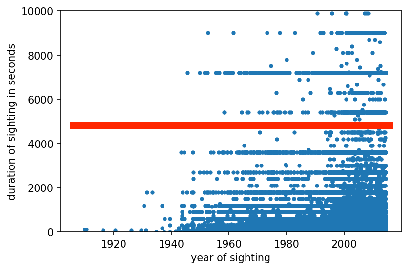
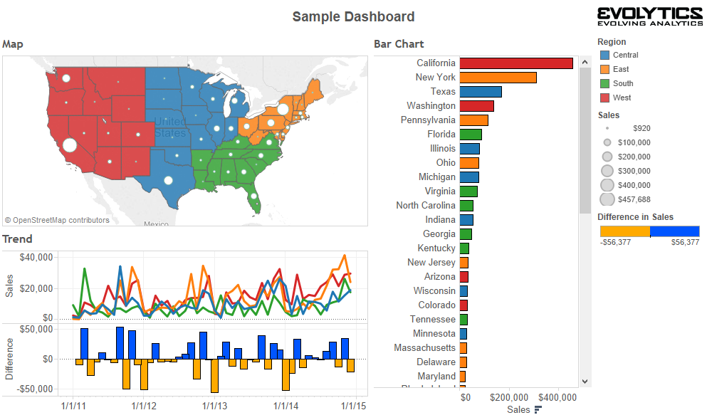

## This lecture

 * ~~Data organization (quick)~~
 * ~~Doing stuff with data~~
 * ~~Dimensions of representation~~


## If time permits

 * Linked data
 * Grammar of Graphics
 * bqplot and dashboarding

notes: hurray! we have time for this!

---

<br />
<br />
<br />

# TOPIC 2: Linking & Brushing - Intro to bqplot

notes: bqplot can be used to make "dashboards" - i.e. linked data views - to help the user make sense of their data

before delving into that, we should specify what we mean by "linked views"

---

## Interactivity: Linking & Brushing

<!-- .slide: data-background-image="images/brushlink_02.svg" data-background-size="80% auto" data-background-position="right 50% bottom 50%" -->

`data(variable1, variable2, variable3, variable4)`

note: here we are plotting a set of data that is a function of 4 variables.

For example, this could be the amount you are late to class as a function of (1) how much sleep you got, (2) how excited you are about the topic that day (3) how nervous you are about the topic that day and (4) how much of your homework the dog ate.

here we are plotting 2 2d plots of this dataset - were we know intuatively each point is represented both as a dot on the first graph *and* as a dot on the 2nd graph

---

## Interactivity: Linking & Brushing

<!-- .slide: data-background-image="images/brushlink_02.svg" data-background-size="80% auto" data-background-position="right 50% bottom 50%" -->

`data(variable1, variable2, variable3, variable4)`

`filter( variable2 > variable1 )`

note: now we are going to think about applying a simple filter, based around the first plot

we'll only show data where variable2 > variable1

---

## Interactivity: Linking & Brushing

<!-- .slide: data-background-image="images/brushlink_03.svg" data-background-size="80% auto" data-background-position="right 50% bottom 50%" -->

`data(variable1, variable2, variable3, variable4)`

`filter( variable2 > variable1 )`

note: lets draw a line where the demarkation of our filter would be

---

## Interactivity: Linking & Brushing

<!-- .slide: data-background-image="images/brushlink_04.svg" data-background-size="80% auto" data-background-position="right 50% bottom 50%" -->

`data(variable1, variable2, variable3, variable4)`

`filter( variable2 > variable1 )`

note: ... and lets take out all the data of both plots that has variable2 <= variable1

---

## Interactivity: Linking & Brushing

<!-- .slide: data-background-image="images/brushlink_05.svg" data-background-size="80% auto" data-background-position="right 50% bottom 50%" -->

note: we can also select regions in our linked view

---

## Interactivity: Linking & Brushing

<!-- .slide: data-background-image="images/brushlink_06.svg" data-background-size="80% auto" data-background-position="right 50% bottom 50%" -->

note: here are how these points are linked in the plot of variable3 vs variable4

---

## Interactivity: Linking & Brushing

<!-- .slide: data-background-image="images/brushlink_07.svg" data-background-size="80% auto" data-background-position="right 50% bottom 50%" -->

note: so when we select with our brush in the first plot we can show what is selected in the second plot

---

## Interactivity: Linking & Brushing with UFO data


note: as a "practical" example, we can for example make cuts in things like the
duration of UFO sitings for all years

this is from a dataset that can be found on the grad-level viz course linked in lesson 06

---

## Interactivity: Linking & Brushing with UFO data



note: we can select only the longest sitings

---

## Interactivity: Linking & Brushing with UFO data


note: this is how this plot would now look

---

## Interactivity: Linking & Brushing with UFO data


note: and then we can see how the map changes

this is our original

---

## Interactivity: Linking & Brushing with UFO data


note: this is how this dataset looks now w/o the shortest duration ufo sitings

---

<iframe width="1024" height="576"
src="https://www.youtube.com/embed/B7XoW2qiFUA?rel=0" frameborder="0"
allow="autoplay; encrypted-media" allowfullscreen></iframe>
[Link to video](https://www.youtube.com/embed/B7XoW2qiFUA)

note: here is one of the first examples of a "linked view" visualization machine.  We won't watch this whole video, but
if you are interested, they talk about how they can "interact" with different views

this was developed by SLAC (stanford linear accelerator)

prim9 = picturing, rotation, isolation & masking in up to 9 dimensions - for looking at multidimensional datasets
this was developed for particle data (so, like x,y,z and vx,vy,vz might be of interest)

---

## Implementing This

Two main approaches to the selection process:

 * Concurrent filtering
 * Index-based selection

What are the pros and cons of each?

What are methods of showing "linked" and "brushed" data if you have:

 * Scatter plot
 * Histogram
 * Field / image plot

---

<br />
<br />
<br />

# TOPIC 3: Imperative vs. Declaritive Viz Programming Languages

---


 * "_Declarative_ programming languages ... are rather like logics in that programs declare statements that are known to be true and relationships between these and other statements."
 * "_Imperative_ programming languages ... state what shall be done in given conditions. They start with an initial state and an explicit set of instructions that describe the process that will unfold."

[Reference](http://cfpm.org/~bruce/logreas/logreas_7.html)

---

## Grammar of Graphics for Declaritive Viz

 * Declaritive viz "paints" graphics on a canvas elements common to all visualizations

<!--[](images/GoG.png)-->


[More info here](https://towardsdatascience.com/a-comprehensive-guide-to-the-grammar-of-graphics-for-effective-visualization-of-multi-dimensional-1f92b4ed4149)

---

## Pandas/Matplotlib: Have been using mostly _Imperatively_

 * [pandas.pydata.org](http://pandas.pydata.org/)
 * Support for indexing, multi-indexing
 * Data structures
   * Series
   * **DataFrame**
   * Panel
 * Groupby, select, aggregation features
 * IO features
   * Reading/writing CSV
   * Loading data from remote sources

---

## Engines

This week we'll be looking at one new visualization engine:

 * `bqplot` - both imperative & declaritive methods

---

## bqplot

Our first engine, `bqplot`, is a Jupyter-based interactive plotting system.

It presents two principal interfaces:

1. `pyplot`-like interface, for making the transition from matplotlib easier
```#python
from bqplot import pyplot as plt
plt.figure(title='A Figure')
plt.plot(x_data, y_data)
plt.show()
```
1. An object-oriented API for constructing interactive visualizations
```#python
scatter_chart = Scatter(x=x_data, y=y_data, scales={'x': x_sc, 'y': y_sc})
fig = Figure(marks=[scatter_chart], title='A Figure', axes=[x_ax, y_ax])
display(fig)
```

notes:
We will be using the latter far more frequently than the former.

---

## Why bqplot?

 * Has a "matplotlib" style similar to what we've been using thus far
 * Also has an option for the declaritive style of viz software like
 d3.js or tableau
 * Allows us to make NYTimes and 538-style visualizations efficiently, and
 without having to
 learn a lot of javascript

---

## Why bqplot?

 * Has a "matplotlib" style similar to what we've been using thus far
 * Also has an option for the declaritive style of viz software like
 d3.js or tableau
 * Allows us to make NYTimes and 538-style visualizations efficiently, and
 without having to
 learn a lot of javascript

Bqplot is built on ipywidgets and *traitlets* - plots now have interactive *traits*.

notes: you can also access traitlets directly as another library in python

we won't go over this in detail, but its something you can look up on your own if you are curious!

---

## Widgets: Our old friends!

We can use the `ipywidgets` library to build out widgets in Jupyter notebooks.
These widgets can be quite extensive with many different operations;
additionally, they can have substantial CSS styling.

---

## Widgets: Our old friends!

We can use the `ipywidgets` library to build out widgets in Jupyter notebooks.
These widgets can be quite extensive with many different operations;
additionally, they can have substantial CSS styling.

We've used simple examples before.  For instance, we can create an interactive
function very easily:

```#python
import ipywidgets

@ipywidgets.interact(name = ['Weezer', 'Nerf Herder', 'Mustard Plug'])
def print_bandname(name):
    print(name)
```

This creates a dropdown that we can select an item from, which is supplied.
What this is doing implicitly is creating a widget with a `value` attribute,
and whenever that `value` is changed, the function is called again.

---

## Widget Types 1

Automatically creating widgets using `@ipywidgets.interact` is very handy and
useful for quick operations, but we can do this more deliberately as well.
There are a number of widgets available in `ipywidgets` already:

 * `IntSlider`, `FloatSlider`, `IntRangeSlider`, `FloatRangeSlider`,
   `IntProgress` and `FloatProgress` all display or allow the user to choose
   values.
 * `IntText`, `FloatText`, `BoundedIntText` and `BoundedFloatText` let the user
   input explicit values to a widget.

---

## Widget Types 2

There are additional widget types that can provide indicators or restricted
selections.

 * `ToggleButton`, `Checkbox` and `Valid` provide boolean indicators; `Valid`
   is read-only.
 * For selection, there are `Dropdown`, `RadioButtons`, `Select`,
   `SelectionSlider` and several others.
 * Strings can be provided using `Text`, `TextArea` and `HTML`.
 * Actions can be enabled through `Button` objects.

Widgets can also be laid out using `HBox`, `VBox`, `Tab`, and `Accordion`.

---

## Events and Linking

In addition to watching for changes, we can watch for events and we can link
two (or more) values between different widgets.  

The special method `on_click` on a `Button` allows for a function to be called
when something is clicked.  We can also link using `ipywidgets.link` and
supplying traits.  For example:

```#python
m = MyObject(name = "Weezer", age=26)
l = ipywidgets.Label()
ipywidgets.link((m, 'name'), (l, 'value'))

display(l)

m.name = 'Nerf Herder'
```

---

## Widgets+Traitlets $\rightarrow$ Back to bqplot

Now that we've learned a bit about widgets, we can start to dig into `bqplot`.
`bqplot` is based around traitlets and widget objects; every object you work
with will have traits and may be represented as a widget.

---

## Widgets+Traitlets $\rightarrow$ Back to bqplot

Now that we've learned a bit about widgets, we can start to dig into `bqplot`.
`bqplot` is based around traitlets and widget objects; every object you work
with will have traits and may be represented as a widget.

When we use `bqplot` we will be constructing `Figure` objects, which will
contain `marks` and `axes`.  To use these, we will build mark objects (`Bars`,
`Lines`, `Scatter`, `Map`, etc) and describe the relationship between points
using `Scale` objects.


---

## Widgets+Traitlets $\rightarrow$ Back to bqplot

Now that we've learned a bit about widgets, we can start to dig into `bqplot`.
`bqplot` is based around traitlets and widget objects; every object you work
with will have traits and may be represented as a widget.

When we use `bqplot` we will be constructing `Figure` objects, which will
contain `marks` and `axes`.  To use these, we will build mark objects (`Bars`,
`Lines`, `Scatter`, `Map`, etc) and describe the relationship between points
using `Scale` objects.

We will be building out these objects and their relationships to develop
interactivity.

---

## bqplot objects: Using Grammar of Graphics

---

## bqplot objects: Using Grammar of Graphics

 * A mark is some mechanism for displaying data.  For example, we might have
   data that has a set of x and y values, which we can use `Lines` to
   represent.

---

## bqplot objects: Using Grammar of Graphics

 * A mark is some mechanism for displaying data.  For example, we might have
   data that has a set of x and y values, which we can use `Lines` to
   represent.
 * `Scale` objects describe relationships between visual attributes (position)
   and data values.

---

## bqplot objects: Using Grammar of Graphics

 * A mark is some mechanism for displaying data.  For example, we might have
   data that has a set of x and y values, which we can use `Lines` to
   represent.
 * `Scale` objects describe relationships between visual attributes (position)
   and data values.
 * `Axis` objects are where data are placed.

---

## bqplot objects: Using Grammar of Graphics

 * A mark is some mechanism for displaying data.  For example, we might have
   data that has a set of x and y values, which we can use `Lines` to
   represent.
 * `Scale` objects describe relationships between visual attributes (position)
   and data values.
 * `Axis` objects are where data are placed.
 * `Figure` objects contain marks and axes, as well as interaction.

---

## bqplot introduction

Our first example will be a simple lineplot.

```#python
import bqplot
import numpy as np

x = np.arange(100)
y = np.random.random(100) + 5

x_sc = bqplot.LinearScale()
y_sc = bqplot.LinearScale()
lines = bqplot.Lines(x = x, y = y, scales = {'x': x_sc, 'y': y_sc})
ax_x = bqplot.Axis(scale = x_sc, label = 'X value')
ax_y = bqplot.Axis(scale = y_sc, label = 'Y value', orientation = 'vertical')
fig = bqplot.Figure(marks = [lines], axes = [ax_x, ax_y])
display(fig)
```

notes: in many ways the above is similar to how we've been making plots up until this point - there is data, we make a figure, we manipulate axes

but the order in which we do things is different - we first start by saying we are using linear scales and *then* make some line object

this is indicative of a *declarative* language

---

<br />
<br />
<br />

# TOPIC 4: Practical application with bqplot

---

## More bqplot

Today, we return to bqplot to explore interactivity.

Recall that with bqplot, we construct a set of objects that are related:

 * Scales
 * Axes
 * Marks
 * Figures
 * Interactions

---

## Scales

We have dealt primarily with quantitative scales.  bqplot provides several
scales we can utilize:

 * `LogScale`
 * `LinearScale`
 * `DateScale`
 * `OrdinalScale`
 * `ColorScale`
 * A few more as well.

([documentation](https://bqplot.readthedocs.io/en/latest/_generate/bqplot.scales.Scale.html))

---

## Marks

bqplot has several different ```marks``` we can explore.  We will utilize a few 
today:

 * ~~`HeatMap`~~
 * `GridHeatMap`
 * ~~`Bars`~~
 * ~~`Graph`~~
 * `Lines`

([documentation](https://bqplot.readthedocs.io/en/latest/_generate/bqplot.marks.Mark.html))

notes: we won't cover the ones that are crossed out explictly, but they are available on bqplot

---

## bqplot interaction

`bqplot` widgets are all based on `ipywidgets`.  This
means we use the same systems for describing the two.

We add an interaction to a given figure via the `interaction` keyword argument
to a figure.

---

## bqplot interactors

We will be able to use these different interaction methods:

 * `FastIntervalSelector`
 * `IndexSelector`
 * `BrushIntervalSelector` & `BrushSelector`
 * `MultiSelector` 
 * `LassoSelector`
 * `HandDraw`
 * `PanZoom`
 * `Tooltip`

notes: we will use just a "selection" tool in our heatmap to make a dashboard, but there are many fun things you can do with bqplot!

---

<br />
<br />
<br />

# TOPIC 3: Dashboarding

---

## Today's Python Programming:

Starting with these ideas, we'll progressively enhance.

 * Create heat maps of eccentricities and radia of Kepler data
 * Plot analytical orbits linked to the user's choices on this heatmap

We'll use these to build up a _dashboard_ for our data.

---

## Dashboards: Tableau


notes: so here is an example of a dashboard, I *think* from Tableau.  Here we see a linked view which
displays data in several different ways to give the user the ability to visualize what their data
means spatially (with the map & region bargraph) and temporally (with the calendar/bar view at the bottom)

---

## Dashboards: Glueviz


note: aside, there are opensource dashboarding type software, this is an example of glueviz that is
used a lot in astronomy and built on python

This is an example of binning light (dark or bright pixels) in an image of a star forming region (I think),
and linking this with a histogram which responds to a selection tool (in red) in the image.

---

## Dashboards: Building our own in Python

To Python!

---

