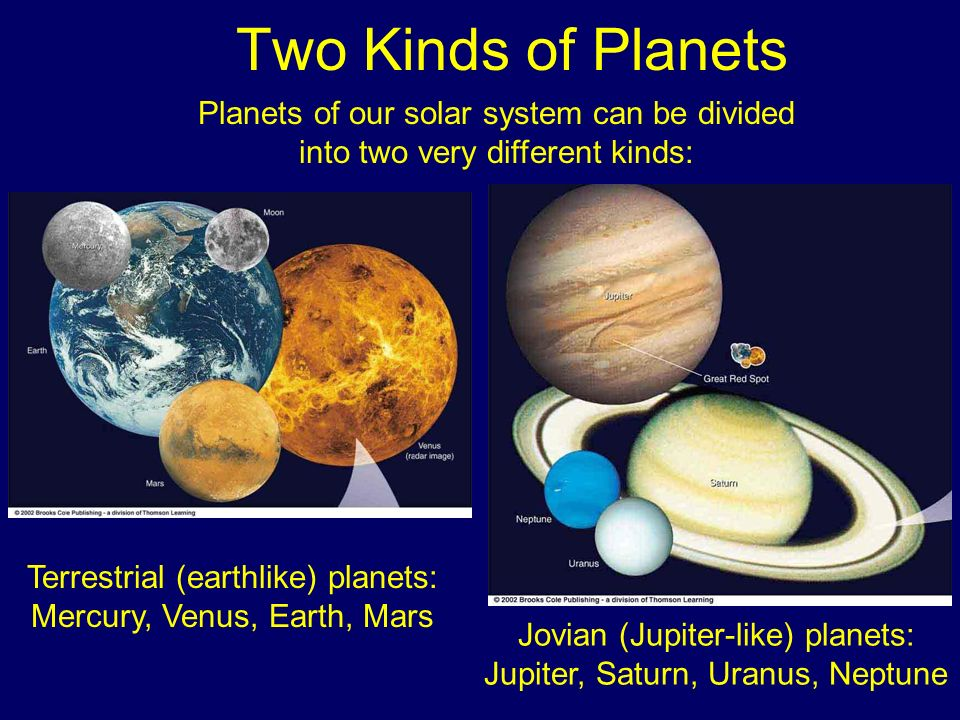

<!-- .slide: class="titleslide" -->

# Intro to Programming & Data Viz
<div style="height: 6.0em;"></div>
## Jill P. Naiman
## Summer 2020
## Lecture 8

---

## Last time

 * Maps & their projections
 * Mappable data with geopandas & GeoJSON
 * Beginning interactivity with ipywidgets
 
notes:
this time we'll do a very brief intro into mapable data & interactivity with ipywidgets

we'll end by combining them to make interactive maps!

---

## This time

 * Crash Course in Astronomy & intro to the Planetary Dataset
 * object-oriented programming & Updating object traits with `traitlets`
 * Linked views with bqplot
 
notes:
this time we'll cover how to "link" data with bqplot and we'll get a brief intro to the dataset we'll be using for the rest of the days of the class -- the planetary dataset from the Kepler sattelite

these will sort of be despirate topics but we'll but them together in the coding portion of the class today, so stick with me as best you can!

---

<br>
<br>
<br>

# Topic #1: Astronomy Crash Course: Planetary Systems

notes:
our first topic will be sort of an astronomy crash course -- a list of things we'll need to know in learning using and visualizing this dataset

---

## Astronomy

The size of stuff:

<iframe width="800" height="450" src="https://www.youtube.com/embed/JeMXuE5KUYQ?rel=0" frameborder="0" allow="accelerometer; autoplay; encrypted-media; gyroscope; picture-in-picture" allowfullscreen></iframe>

(Actually not largest star - we know of several more larger!)

notes: so this just gives you a sort of size scale of the things we'll be talking about - we'll be dealing with planets and planetary systems (ours is called the solar system!)

We can't watch this together as a group online with sound but I HIGHLY recommend you check it out on your own since it has spectacular music and is silly

---

## Astronomy 

A reminder of where we are:


notes: So, here is where we are.  This Earth, Boston approximately *there*

---

## Astronomy 

A reminder of where we are:


notes: the Earth is part of the solar system with several planets/planetismals, and other things orbiting our own neighborhood star, the sun

In this image, the planets are to scale, but the distances are not

---

## Astronomy 

A reminder of where we are:


notes: in this image, the distances are now to scale, but the size of planets are not - if the planets were on the correct size scale then we wouldn't be able to see them because they would be much much smaller than the Sun

notice how small the orbits of the inner planets like earth and mars are compared to the outer planets

---

## Astronomy 

A reminder of where we are:


notes: if we zoom out even further, we see that our solar system that is orbiting our local star, the Sun is just one of several stars nearby, here just focusing on the brightest ones

---

## Astronomy 

A reminder of where we are:


notes: if we zoom out even further we find that these local group of stars is actually collected in an object called a "galaxy", and our galaxy is called the "Milky Way"

The milky Way has about 250 billion stars in it.

This is of course just a guess at what the milky way looks like - in reality we are sitting about 1/2 way out in the disk and so we can't see what the whole thing looks like we can only see the disk "edge on" which is what the bright strip of sky looks like if you go out to an area without many artificial lights at night 

---

## Astronomy 

A reminder of where we are:


notes: this is what it looks like if you've never had an opportunity to see it before in a very dark area

---

## Astronomy 

A reminder of where we are:


notes: if we zoom out even further we find that that our milky way is surrounded by a lot of little, relatively star-less galaxies called "dwarf galaxies" and it has a neighbor called the Andromeda galaxy

Our Milky Way will actually collide with the Andromeda galaxy in about 4.5 billion years, but fun fact - nearly none of the individual stars will not collide with eachother!

---

## Astronomy 

A reminder of where we are:


notes: and if we keep zooming out we see that there are actually trillions of galaxies in the Universe!  This is an actual image taken with the Hubble space telelscope of a very very small little bit of the sky and all of these points of light are actually galaxies

---

## Astronomy 

A bit more about planets:



notes: so, lets step back in in scale and look back again at planets in a bit more detail

It turns out as far as well can tell, a good number of stars besides our own contain planetary systems that orbit them

There are 2 basic types of planets - terresstrial that are rocky and earth-like, and Jovian that are like our Jupiter that are mostly gas planets

---

## Astronomy 

A bit more about planets:


notes: notice that this is actually an older figure and there are actually many more planets that we've found with the Kepler telescope than is plotted here

On the y-axis here we have plotted the size in earth-radii of these planets found in a *log* scale - so at the top we are plotting objects that have sizes about the size of jupiter

On the bottom we have plotted the orbital time in days, again in a log scale.  So the earth would be right about *here*

You can see that there is a gab in the plot there and you might wonder if this is because Earths are rare.  But in fact its likely a function of how we measure these things - with Kepler we are looking for "dips" in the brightness of stars due to planets...

---

## Astronomy 

A bit more about planets:

<iframe width="800" height="450" src="https://www.youtube.com/embed/3Wxd3fDFmO4?start=55" frameborder="0" allow="accelerometer; autoplay; encrypted-media; gyroscope; picture-in-picture" allowfullscreen></iframe>

notes: ...so this means that bigger planets closer to their stars will be seen more easily

---

## Astronomy 

A bit more about planets:

<iframe width="800" height="450" src="https://www.youtube.com/embed/Td_YeAdygJE?rel=0" frameborder="0" allow="accelerometer; autoplay; encrypted-media; gyroscope; picture-in-picture" allowfullscreen></iframe>

more info: http://astro.uchicago.edu/~fabrycky/kepler/

notes: you can see this more with this nice visualization of planetary systems here - it seems like there are a lot of big, close in things, but again, this is likely because of the way we are measuring things

---

## Categorizing Planets & Their Orbits


notes: 
now we'll chat about Kepler's laws, focusing on his first law

kepler was another "big deal" in Astronomy - and along with Tycho Brahe did a lot of work on orbital motion

we'll be using data from the Kepler satellite which was named after him

---

## Kepler's Laws

**Kepler's Law #1**: All planets move about the Sun in elliptical orbits, having the Sun as one of the foci.


notes: 

so we've been talking a lot about circular motion and how gravity might allow for objects to move around objects like the earth in a circular fashion

Now we're going to start thinking about orbits in reality - it turns out these are actually ellipses, not circles. 

The reasons behind this have to do with physics beyond what we are going to talk about here, but you can check out the course webpage from last year to learn more!

---

## Kepler's Laws

**Kepler's Law #1**: All planets move about ~~the Sun~~ their host star in elliptical orbits, having the ~~Sun~~ host star as one of the foci.


notes: this brings us back to Kepler's first law which should really be updated for the fact that we now have found so many exoplanets outside our solar system!


---

## Kepler's Laws $\rightarrow$ Ellipses and Conic Sections

**Kepler's Law #1**: All planets move about ~~the Sun~~ their host star in elliptical orbits, having the ~~Sun~~ host star as one of the foci.


Ok, but what is an ellipse?

notes: this brings us back to Kepler's first law which should really be updated for the fact that we now have found so many exoplanets outside our solar system!

---

## Ellipses

Planetary orbits follow **elliptical** paths.

What is an ellipse?


notes: the first way we can think of an ellipse is how we can draw one by hand: if you take 2 tacks and a length of string, you can draw an ellipse by placing a pencil in the string and drawing around the tacks

think about - how does it look if the tacks are very close together?  What about far apart?

---

## Ellipses

There is a lot of other terminology you might run into with ellipses.


notes: for example, we call the largest axis of this object the "major" axis and the smaller axis the "minor" axis

"major" is usually denoted with an "a" and "minor" with a "b" but you should always double check this

There are 2 focuses or "foci" that are basically where we would put the tacks if we were drawing this by hand

---

## Ellipses

There are many ways to write this ellipse shape as a formula.  In cartesian, or rectangular coordinates:

$$ \frac{x^2}{a^2} + \frac{y^2}{b^2} = 1$$


notes: these are for ellipses that are centered at the origin

How does this equation change if the center of the ellipse is at a different position?  Lets say x0 and y0?

---

## Ellipses

Non-centered ellipse:

$$ \frac{(x-x\_0)^2}{a^2} + \frac{(y-y\_0)^2}{b^2} = 1$$

---

## Ellipses

Non-centered ellipse:

$$ \frac{(x-x\_0)^2}{a^2} + \frac{(y-y\_0)^2}{b^2} = 1$$

Area of an ellipse:

$$ A= \pi a b $$

---

## Ellipses as conic sections


notes: ellipses are actually part of a family of geometrical objects called "conic sections" that can be created by taking different sorts of slices through 3D cones. 

The other 2 objects are parabolas and hyperbolas.  There are some orbits that follow these trajectories instead of ellipses.  These represent "unbound orbits" because, as you can see, they are paths that never return to were they started - only ellipses represent orbits that actually, well, orbit, instead of slingshoting off somewhere.

More on this idea a bit later.

---

## Kepler's Laws $\rightarrow$ Ellipses and Conic Sections

**Kepler's Law #1**: All planets move about ~~the Sun~~ their host star in elliptical orbits, having the ~~Sun~~ host star as one of the foci.


Ok, but what is an ellipse? Now we know!

notes: now that we know a bit more about what ellipses are, lets go back to looking at Kepler's laws

---

## Kepler's Laws for Multi-body systems?


notes: while these laws don't hold for multi-body system, when there is a planetary system with a large sun, and the rest of the planets have masses much smaller than this sun

in this case, as a first brush, we can assume that each planet is orbiting a central star and figure out orbits that way

Later, we can use this to compare solutions we generate using Euler's method to what we find here

---

## Kepler's Laws for Multi-body systems?

For one massive star at the center of the system, orbits can be written as:

<div class="left">

$$ r(\theta) = \frac{a (1-e^2)}{1 + e cos(\theta)} $$

$$ e = \sqrt{1 - \frac{b^2}{a^2}} $$

</div>

<div class="right">


</div>

---

## Kepler's Laws for Multi-body systems?

For one massive star at the center of the system, orbits can be written as:

<div class="left">

$$ r(\theta) = \frac{a (1-e^2)}{1 + e cos(\theta)} $$

$$ e = \sqrt{1 - \frac{b^2}{a^2}} $$

</div>

<div class="right">


</div>

Note the limits on $e$ (eccentricity):
 * if $b = 0$, $e = 1$ $\rightarrow$ this is a parabola
 * if $a = b$, $e = 0$ $\rightarrow$ this is a perfect circle

---

## Kepler's Laws for Multi-body systems?

For one massive star at the center of the system, orbits can be written as:

<div class="left">

$$ r(\theta) = \frac{a (1-e^2)}{1 + e cos(\theta)} $$

$$ e = \sqrt{1 - \frac{b^2}{a^2}} $$

</div>

<div class="right">


</div>

Note the limits on $e$ (eccentricity):
 * if $b = 0$, $e = 1$ $\rightarrow$ this is a parabola
 * if $a = b$, $e = 0$ $\rightarrow$ this is a perfect circle
 
Beware: $r(\theta)$ is trivial, but $r(t)$ and $\theta(t)$ are not easy to calculate and require numerical methods!

---

## Kepler's Laws for Multi-body systems?

For one massive star at the center of the system, orbits can be written as:

<div class="left">

$$ r(\theta) = \frac{a (1-e^2)}{1 + e cos(\theta)} $$

$$ e = \sqrt{1 - \frac{b^2}{a^2}} $$

</div>

<div class="right">


</div>

Note the limits on $e$ (eccentricity):
 * if $b = 0$, $e = 1$ $\rightarrow$ this is a parabola
 * if $a = b$, $e = 0$ $\rightarrow$ this is a perfect circle
 
Beware: $r(\theta)$ is trivial, but $r(t)$ and $\theta(t)$ are not easy to calculate and require numerical methods!

PS: if $e > 1$ $\rightarrow$ this is a hyperbola

---

<br> 
<br>
<br>

<h2><a href="https://www.khanacademy.org/partner-content/nasa/measuringuniverse/orbital-mechanics/pi/interact-elliptical-orbits">INTERACT: Elliptical orbits</a></h2>

notes:
we can even play with this with this little online widget

Here the Sun in the system is the yellow dot, and the planet is the moving purple dot, the gray dot is the other "foci" of the ellipse

**give them a few moments to play with it**

What did you notice?  
 * what happened when you moved the sun closer to the other focus?
 * what makes the eccentricity higher or lower?
 * where does the planet move the fastest?

---

## The Kepler Planet Database

A bit more about planets:

<iframe width="800" height="450" src="https://www.youtube.com/embed/Td_YeAdygJE?rel=0" frameborder="0" allow="accelerometer; autoplay; encrypted-media; gyroscope; picture-in-picture" allowfullscreen></iframe>

more info: http://astro.uchicago.edu/~fabrycky/kepler/

notes: 
now that we know a bit more about the orbits of planets, let's take a look again at this video of all the planets observed with the Kepler sattelite

What do you notice? (circular, bit, etc).

---

## The Kepler Planet Database

[NASA Exoplanet Archive](https://exoplanetarchive.ipac.caltech.edu/)
  * [Confirmed Planets](https://exoplanetarchive.ipac.caltech.edu/cgi-bin/TblView/nph-tblView?app=ExoTbls&config=planets&constraint=pl_facility%20like%20%27Transiting%20Exoplanet%20Survey%20Satellite%20(TESS)%27)

notes:
we'll be grabbing data from the NASA exoplanet archive which has a lot of info about plannets found with Kepler & more recently TESS which is a new sattelite

---

<br>
<br>
<br>

# Topic #2: Object Oriented Crash Course & Updating Object Traits

---

# Background: Object-Oriented Programming


notes:
What are some traits every vehicle has?

---

## Object-Oriented Programming

Vehicles:
 * number of wheels
 * color
 * weight

notes:
this set of traits won't necessarily be useful for things that aren't vehicles. 

---

## Object-Oriented Programming

class Vehicles:
 * int: number of wheels
 * string: color
 * float: weight

notes:
in object-oriented programming, we can use this "class" keyword to create a new object type "vehicle" which has traits that are the data types we're already familiar with - integers, floats, strings, booleans, etc.

This is like buying salad at the grocery store. You can either buy lettuce, onions, croutons, and dressing separately, or you can buy prepackaged salads with different combinations of those things already put together.

---

## Updating Traits

class Vehicles:
 * int: number of wheels
 * string: color
 * float: weight

```#python
myVehicle = Vehicles()
myVehicle.number_of_wheels = 4
myVehicle.color = 'brown'
myVehicle.weight = 2.5 # tons
```

notes:
Using this sort of idea, I can make an "object" that has some information stored about it, let's call this object `myVehicle` and I can set these attributes or *traits* of my vehicle using the `.` notation

---

## Updating Traits

class Vehicles:
 * int: number of wheels
 * string: color
 * float: weight

```#python
myVehicle = Vehicles()
myVehicle.number_of_wheels = 4
myVehicle.color = 'brown'
myVehicle.weight = 2.5 # tons
```

Function that acts on an object of the Vehicles class:

```#python
def paint_a_vehicle(vehicle):
...
```

notes:
now let's say I make a function that paints my car, certainly the `myVehicle` object should change in color!

---

## Updating Traits

class Vehicles:
 * int: number of wheels
 * string: color
 * float: weight

```#python
myVehicle = Vehicles()
myVehicle.number_of_wheels = 4
myVehicle.color = 'brown'
myVehicle.weight = 2.5 # tons
```

Function that acts on an object of the Vehicles class:

```#python
def paint_a_vehicle(vehicle):
...
```

"Observe" changes in our object:

```#python
myVehicle.observe(paint_a_vehicle, ['color'])
```

notes:
to do that we have to make sure the myVehicle object is sort of waiting and *observing* for a change in its color so that once we run this function, this *trait* of myVehicle gets updated

---

## Updating Traits

```#python
import traitlets

class Vehicles(traitlets.HasTraits):
    number_of_wheels = traitlets.Int()
    color = traitlets.Unicode() # basically another name for string
```

notes:
how would this look fully in python?

First, we would start with the Vehicles class (here I'm leaving out the weights trait for brievity)

---

## Updating Traits

```#python
import traitlets

class Vehicles(traitlets.HasTraits):
    number_of_wheels = traitlets.Int()
    color = traitlets.Unicode() # basically another name for string
```

```#python
myVehicle = Vehicles()
myVehicle.number_of_wheels = 4
myVehicle.color = 'brown'
```

notes:
then we would define an object of this class, like before

---

## Updating Traits

```#python
import traitlets

class Vehicles(traitlets.HasTraits):
    number_of_wheels = traitlets.Int()
    color = traitlets.Unicode() # basically another name for string
```

```#python
myVehicle = Vehicles()
myVehicle.number_of_wheels = 4
myVehicle.color = 'brown'
```

OR

```#python
myVehicle = Vehicles(number_of_wheels = 4, color = 'brown')
```

notes:
alternitavely we could define it in one like like this which is sort of nice & compact

---

## Updating Traits

```#python
import traitlets

class Vehicles(traitlets.HasTraits):
    number_of_wheels = traitlets.Int()
    color = traitlets.Unicode() # basically another name for string
```

```#python
myVehicle = Vehicles(number_of_wheels = 4, color = 'brown')
```


```#python
def paint_a_vehicle_blue(change):
	change['owner'].color = 'blue'
```


notes:
then we would make that function that changes the car's paint

note that I've written it a little different here with this "change" and 'owner' -- we'll talk about that when we do some hands-on Python stuff

---

## Updating Traits

```#python
import traitlets

class Vehicles(traitlets.HasTraits):
    number_of_wheels = traitlets.Int()
    color = traitlets.Unicode() # basically another name for string
```

```#python
myVehicle = Vehicles(number_of_wheels = 4, color = 'brown')
```


```#python
def paint_a_vehicle_blue(change):
	change['owner'].color = 'blue'
```

In this case, we are watching the trait `color` for changes.  When a change
occurs, the function `paint_a_vehicle_blue` is called.  The argument is a *dict* with
these values:

 * `new`: the new value the trait has
 * `old`: the previous value
 * `type`: the type of change
 * `owner`: the object that owns this trait
 * `name`: the name of the trait

notes:
then we would make that function that changes the car's paint

note that I've written it a little different here with this "change" and 'owner' -- we'll talk about that when we do some hands-on Python stuff

basically, this "change" is an object called a dict or dictionary -- which is basically like the sorts of objects we used when we used Pandas and selected columns

---

## Updating Traits

```#python
import traitlets

class Vehicles(traitlets.HasTraits):
    number_of_wheels = traitlets.Int()
    color = traitlets.Unicode() # basically another name for string
```

```#python
myVehicle = Vehicles(number_of_wheels = 4, color = 'brown')
```


```#python
def paint_a_vehicle_blue(change):
	change['owner'].color = 'blue'
```

```#python
myVehicle.observe(paint_a_vehicle_blue, ['color'])
```

notes:
finally, we have to observe this change when the function gets called so that the myVehicle color actually gets changed!

---

<br>
<br>
<br>

# Topic #3: bqplot

---

## bqplot

Our first engine after `matplotlib`, `bqplot`, is a Jupyter-based interactive plotting system built on `ipywidgets` and `traitlets`.

It presents two principal interfaces:

1. `pyplot`-like interface, for making the transition from matplotlib easier
```#python
from bqplot import pyplot as bplt
bplt.figure(title='A Figure')
bplt.scatter(x_data, y_data)
bplt.show()
```
1. An object-oriented API for constructing interactive visualizations
```#python
scatter_chart = Scatter(x=x_data, y=y_data, scales={'x': x_sc, 'y': y_sc})
fig = Figure(marks=[scatter_chart], title='A Figure', axes=[x_ax, y_ax])
display(fig)
```

notes:
we will do a bit of plotting using bqplot which is built from widgets & traitlets

technically there are 2 interfaces -- a matplotlib-like one and a "declaritive" API 

---

## bqplot

Our first engine after `matplotlib`, `bqplot`, is a Jupyter-based interactive plotting system built on `ipywidgets` and `traitlets`.

It presents two principal interfaces:

1. `pyplot`-like interface, for making the transition from matplotlib easier
```#python
from bqplot import pyplot as bplt
bplt.figure(title='A Figure')
bplt.scatter(x_data, y_data)
bplt.show()
```
1. ~~An object-oriented API for constructing interactive visualizations~~

notes:
in the interest of time we will not be covering the 2nd way of doing things BUT you might find this different way of doing things in the docs, so just a heads up on that

---

## Why bqplot?

 * Has a "matplotlib" style similar to what we've been using thus far
 * Also has an option for the declaritive style of viz software like
 d3.js or tableau
 * Allows us to make NYTimes and 538-style visualizations efficiently, and
 without having to
 learn a lot of javascript

---

## bqplot

Now that we've learned a bit about widgets, we can start to dig into `bqplot`.
`bqplot` is based around traitlets and widget objects; every object you work
with will have traits and may be represented as a widget.

---

## bqplot

Now that we've learned a bit about widgets, we can start to dig into `bqplot`.
`bqplot` is based around traitlets and widget objects; every object you work
with will have traits and may be represented as a widget.

When we use `bqplot` we will be constructing `Figure` objects, which will
contain `marks` and `axes`.  To use these, we will build mark objects (`Bars`,
`Lines`, `Scatter`, `Map`, etc) and describe the relationship between points
using `Scale` objects.

---

## bqplot

Now that we've learned a bit about widgets, we can start to dig into `bqplot`.
`bqplot` is based around traitlets and widget objects; every object you work
with will have traits and may be represented as a widget.

When we use `bqplot` we will be constructing `Figure` objects, which will
contain `marks` and `axes`.  To use these, we will build mark objects (`Bars`,
`Lines`, `Scatter`, `Map`, etc) and describe the relationship between points
using `Scale` objects.

We will be building out these objects and their relationships to develop
interactivity.

---

# To Python!

That was all a bit abstract, let's actually practice this stuff!
