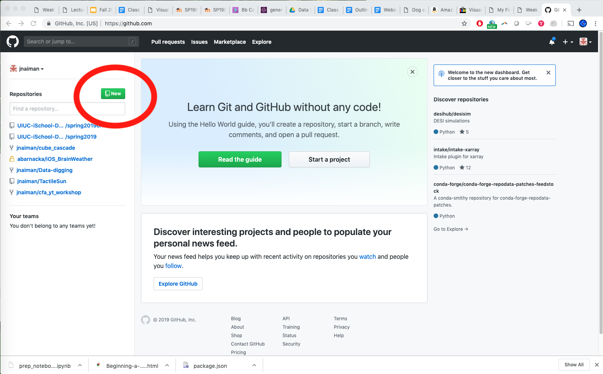

# Please note this is an optional activity

You are expected to get a bit lost in the weeds!

---

## GitHub Pages

Pros: 
 * Community driven (there's lots of support)
 * Free hosting

Cons:
 * Community driven (there can be bugs and surprises)
 * You only get the one webpage


---

## Keep in mind: Technical Limitations

 * Memory
 * Screen Size
 * Interaction technique (mouse and keyboard vs touchscreen)
 * Disk space

---

## Jupyter notebooks: getting your viz on the web

We'll be using github pages (github.io) to do this - for a *full* notebook.

The steps will be:

 * Create the repository ```[username].github.io``` 
 * Clone this repository
 * Fill it with your Jupyter notebook & dataset
 * Push your repository
 * Use [mybinder.org](https://mybinder.org/) to create a link to your notebook
 * PROFIT

notes: the process for building a jupyter notebook will be very much the same, the steps are just a little different

---

## Jupyter notebooks: getting your viz on the web

We'll be using github pages (github.io) to do this - for a *previously generated html page*.

The steps will be:

 * Create the repository ```[username].github.io``` 
 * Clone this repository
 * Fill it with your ```html``` page generated from your notebook.
 * Push your repository
 * Navigate to ```http://[username].github.io/[pagename].html```
 * PROFIT

notes: the process for building a jupyter notebook will be very much the same, the steps are just a little different

---

## github.io for publishing

Step 1: Create/login to your github account

(We'll also do this "live" in the coding section of class)

---

## github.io for publishing

Step 2: Create new repository


---

## github.io for publishing

Step 2: Create new repository



---

## github.io for publishing

Step 3: Name your new repository as ```[username].github.io```


---

## github.io for publishing

Step 3: Name your new repository as ```[username].github.io```


notes: the name is important here!!

---

## github.io for publishing

Step 4: Clone your repository


---

## github.io for publishing

Step 4: Clone your repository


notes: make note of your git name, we'll use this for "cloning" our github repo

---

## github.io for publishing

Step 5: Clone your repository
 * In command line do: ```git clone YOUR_REPO_LINK```

Step 6: Copy your ```html``` page to this directory

---

## github.io for publishing

Step 7: Add these files to your repo officially
 * ```git add -A```
 
Step 8: Commit these files (say what you are doing)
 * ```git commit -m "my first add" ```
 
Step 9: Push to your online repo
 * ```git push```
 
Step 10: wait for your website to build and then check it out!
 * Link: ```https://YOUR_GITHUB_USER_NAME.github.io/```

---

## github.io for publishing Jupyter notebooks

For a full notebook file: you need to link this on [mybinder.org](https://mybinder.org)

---

## github.io for publishing Jupyter notebooks


notes: Here, we just put in a link to our "home" github.io page and we also put a link to our specific notebook file

Then we can press "launch" and away we go!

Also, for some cases you can use "nbviewer" to render notebooks.  However, this doesn't work with the latest version of ipywidgets and bqplot. Hopefully that will change soon!

